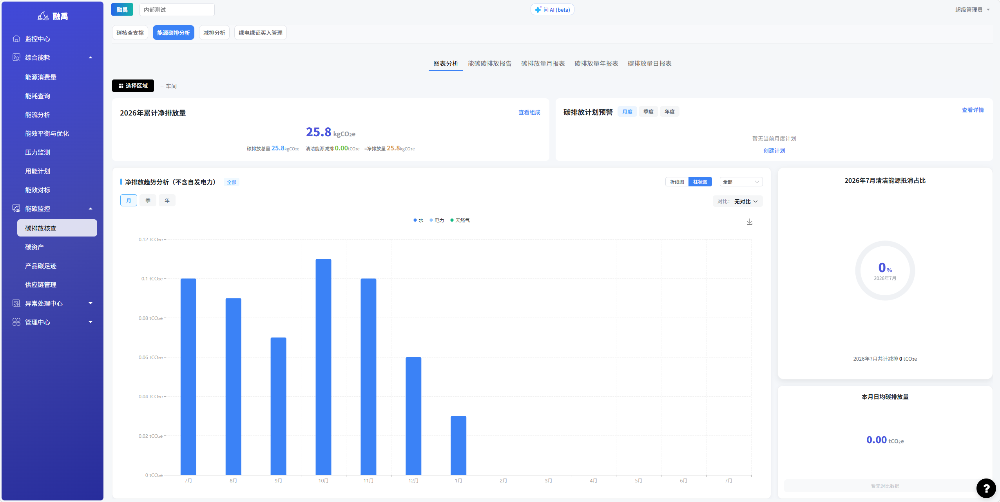

# 碳排放核查

## 系统概述

碳排放核查是碳排放管理系统的核心页面，承担企业碳排放数据的汇总、分析、预警与报告职能。页面整合了碳核查支撑、能源碳排分析、减排分析、绿电绿证买入管理四大子模块，并提供图表分析、碳排放报告、月/年/日报表等多种报表视图，帮助管理者全面掌握碳排放现状、趋势与合规进展。

## 核心功能

### 1. 子标签页导航

页面顶部提供 4 个子标签页，用于切换不同的业务视角：

| 标签页 | 说明 |
|--------|------|
| **碳核查支撑** | 碳核查所需的支撑材料、文件与数据底稿管理 |
| **能源碳排分析**（默认） | 核心分析页面，展示能源消耗对应的碳排放数据与趋势 |
| **减排分析** | 减排措施的执行效果分析与减排量统计 |
| **绿电绿证买入管理** | 绿色电力与绿色证书的采购记录、核销与抵消管理 |

### 2. 报表类型标签

在"能源碳排分析"子标签页下，提供 5 种报表视图切换：

| 报表类型 | 说明 |
|----------|------|
| **图表分析**（默认） | 可视化图表展示，包含趋势图、占比图等交互式分析 |
| **能碳碳排放报告** | 完整的能碳碳排放分析报告 |
| **碳排放量月报表** | 按月汇总的碳排放量统计报表 |
| **碳排放量年报表** | 按年汇总的碳排放量统计报表 |
| **碳排放量日报表** | 按日统计的碳排放量明细报表 |

### 3. 筛选区

图表分析页面顶部提供**区域选择**筛选器，支持按不同区域（如厂区、楼层、部门等）过滤数据，便于分区域查看碳排放情况。

### 4. 数据卡片

#### 4.1 累计净排放量卡片
 
- **显示内容**：2026年累计净排放量（单位：tCO₂e）
- **计算公式**：碳排放总量 − 清洁能源减排 = 净排放量
- **交互操作**：点击「查看组成」按钮，弹出明细窗口，展示碳排放总量和清洁能源减排量各分项的构成明细

#### 4.2 碳排放计划预警卡片

- **显示内容**：月度/季度/年度三个维度的碳排放计划预警状态
- **操作入口**：
  - 点击「查看详情」：查看当前预警的具体指标、阈值与当前值对比
  - 点击「创建计划」：进入碳排放计划创建流程，设定各周期排放目标

### 5. 净排放趋势分析（不含自发电力）

提供可交互的碳排放趋势图表，支持多维度配置：

| 配置项 | 选项 | 说明 |
|--------|------|------|
| **时间粒度** | 月 / 季 / 年 | 控制 X 轴时间刻度间隔 |
| **图表类型** | 折线图 / 柱状图 | 切换数据可视化形式 |
| **对比方式** | 无对比 / 同比 / 环比 | 同比为去年同期对比，环比为上一周期对比 |
| **数据分类** | 水 / 电力 / 天然气 | 选择展示的能源类型 |

- **导出功能**：支持将当前图表数据导出为文件

### 6. 清洁能源抵消占比

以**环形图**形式直观展示清洁能源在总碳排放中的抵消占比（%），帮助快速评估企业绿色能源使用水平。

### 7. 本月日均碳排放量

展示当月的日均碳排放量数值（单位：tCO₂e），用于监控日常排放强度。

