# 产品碳足迹

## 1. 功能概述

### 1.1 什么是产品碳足迹

产品碳足迹（Product Carbon Footprint, PCF）是指产品在**全生命周期**内产生的温室气体排放总量，以二氧化碳当量（CO₂e）表示。涵盖从原材料获取、生产制造、运输配送、使用到废弃处理的完整过程。

### 1.2 本板块功能

产品碳足迹板块提供以下核心功能：

| 功能模块 | 说明 |
|---------|------|
| **产品立项** | 新增待核算的产品，填写基础信息 |
| **生命周期要素核算** | 按阶段录入碳排放数据 |
| **副产品分配与回收** | 记录可回收材料及其碳抵扣 |
| **核算结果总览** | 查看碳足迹统计、碳流图、占比分析 |
| **碳排放核查** | 对核算数据进行审计确认 |

---

## 2. 参考标准

本系统产品碳足迹核算遵循以下标准：

| 标准编号 | 标准名称 | 说明 |
|---------|---------|------|
| **GB/T 24067-2024** | 温室气体 产品碳足迹 量化要求和指南 | 我国产品碳足迹核算通则国家标准 |
| **ISO 14067:2018** | 温室气体 产品碳足迹 量化要求和指南 | 国际标准化组织发布的PCF核算标准 |
| **PAS 2050:2011** | 商品和服务在生命周期内的温室气体排放评价规范 | 英国标准协会发布的产品碳足迹评价规范 |

> 📌 **提示**：GB/T 24067-2024 修改采用 ISO 14067:2018，是我国企业开展产品碳足迹核算的主要依据。

---

## 3. 快速入门

### 3.1 核算流程概览

系统采用四步向导式核算流程：


```
步骤1 物理边界宣告 → 步骤2 生命周期要素核算 → 步骤3 副产品分配与回收 → 步骤4 确认结果
```

### 3.2 产品碳足迹核算档案（产品大盘）

进入【产品碳足迹】后，首先看到的是**产品碳足迹核算档案**列表页，展示所有已立项产品。

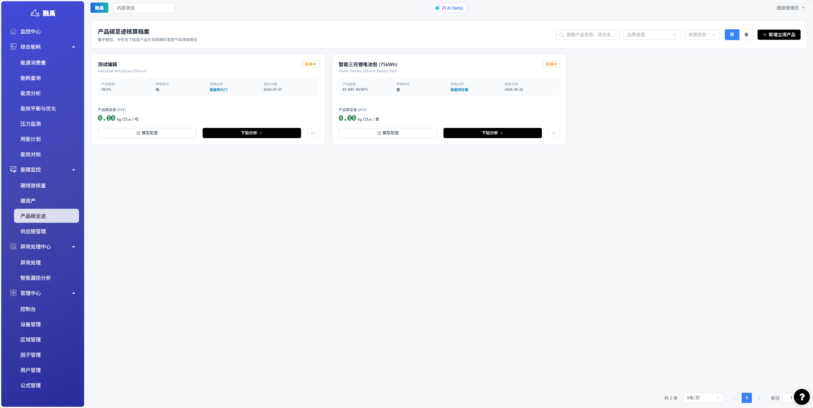

每个产品卡片展示：产品名称、产品规格、声明单位、核算边界、更新日期、核算状态（核算中/已审计）和产品碳足迹（PCF）值。可点击**「下钻分析」**进入详细核算页面，或点击**「模型配置」**重新编辑数据。

### 3.3 四步核算流程

**步骤1：物理边界宣告**
- 填写产品中文名/英文名、规格型号、声明单位
- 选择LCA边界（从摇篮到大门 / 从摇篮到坟墓）
- 右侧面板展示ISO 14067:2018物理边界向导说明

---

## 4. 详细操作指南

### 4.1 新增立项（物理边界宣告）

#### 操作路径
产品碳足迹 → 新增立项产品

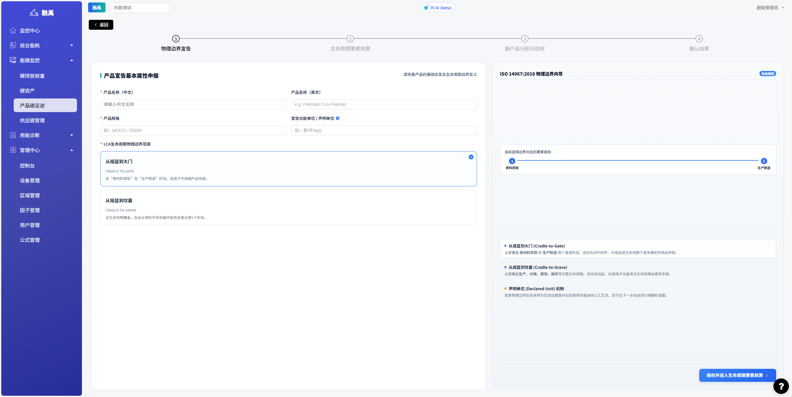

#### 填写字段说明

| 字段 | 说明 | 示例 |
|-----|------|------|
| 产品名称 | 产品的正式名称 | 磷酸铁锂电池模组 |
| 产品类别 | 所属产品类别 | 储能类工业产品 |
| 规格型号 | 产品型号/规格参数 | LFP-50kWh-280Ah |
| 声明单位 | 核算的功能单位 | 组 / 件 / kg / kWh |
| LCA物理边界 | 生命周期边界范围 | 从摇篮到大门 / 从摇篮到坟墓 |
| 年产量 | 产品年产量 | 10000组 |

#### LCA边界选择

- **从摇篮到大门（Cradle-to-Gate）**：涵盖从原材料获取到产品出厂，不含使用和废弃阶段。适用于B2B中间产品。
- **从摇篮到坟墓（Cradle-to-Grave）**：涵盖产品全生命周期，包括使用、废弃处理。适用于终端消费品。

---

### 4.2 生命周期要素核算


页面顶部显示4步进度条，当前步骤高亮。左侧为**生命周期阶段**管理区，可输入自定义阶段名称并添加。右侧为当前阶段的数据录入区，包含5个标签页：

| 标签页 | 说明 |
|--------|------|
| **原辅材料投入** | 原材料开采、加工环节的碳排放 |
| **独立货运物流** | 原材料和成品的运输排放 |
| **制造能耗动力** | 生产过程中的能源消耗 |
| **成品出厂包装** | 产品出厂包装材料的碳排放 |
| **末端排污** | 废弃物处理产生的排放 |

#### 4.2.1 原辅材料投入

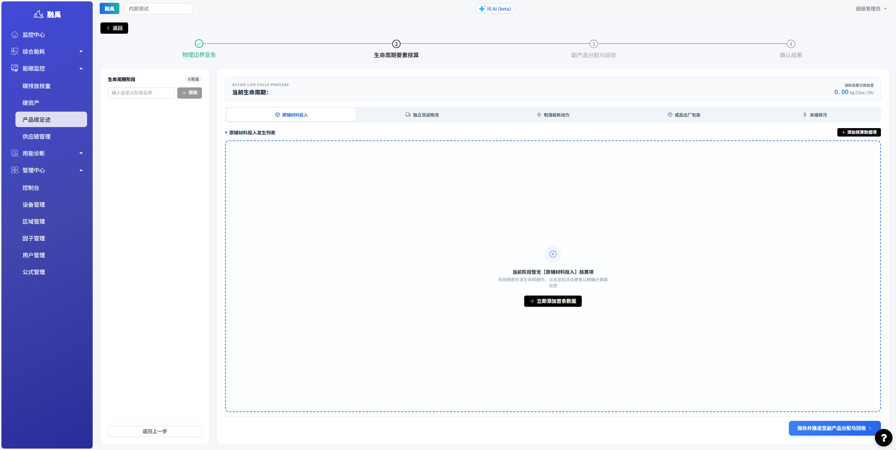

点击**「立即添加首条数据」**或右上角**「添加核算数据项」**弹出配置表单：

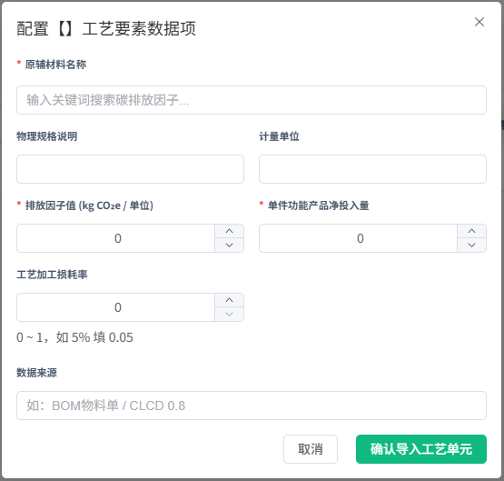

| 字段 | 说明 |
|-----|------|
| 原辅材料名称 | 输入关键词搜索碳排放因子，或手动填写 |
| 物理规格说明 | 材料的规格型号 |
| 计量单位 | kg、g、m³等 |
| 排放因子值 (kg CO₂e / 单位) | 每单位材料的碳排放量 |
| 单件功能产品净投入量 | 单件产品消耗的材料数量 |
| 工艺加工损耗率 | 0~1，如5%填0.05 |
| 数据来源 | 如：BOM物料单 / CLCD 0.8 |

#### 4.2.2 独立货运物流

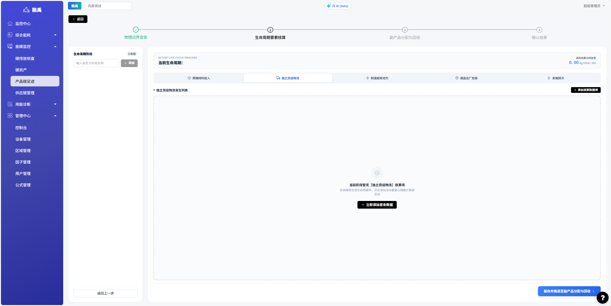

点击**「立即添加首条数据」**弹出货运配置表单：

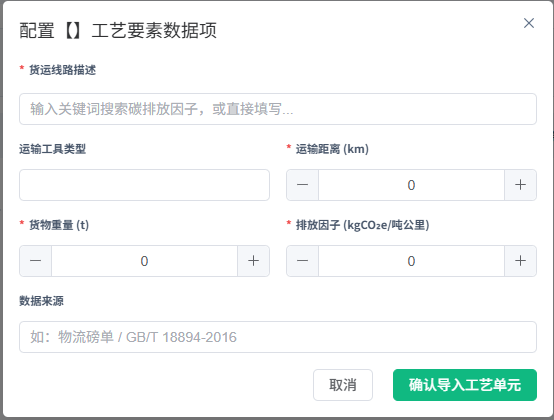

| 字段 | 说明 |
|-----|------|
| 货运线路描述 | 输入关键词搜索碳排放因子，或直接填写 |
| 运输工具类型 | 公路/铁路/海运/空运 |
| 运输距离 (km) | 公里数 |
| 货物重量 (t) | 吨 |
| 排放因子 (kg CO₂e/吨公里) | 单位运输的碳排放量 |
| 数据来源 | 如：物流磅单 / GB/T 18894-2016 |

**常见运输方式碳排放因子：**

| 运输方式 | 碳排放因子 | 单位 |
|---------|-----------|------|
| 公路（柴油卡车） | 0.03 ~ 0.15 | kg CO₂e/t·km |
| 铁路 | 0.01 ~ 0.03 | kg CO₂e/t·km |
| 海运 | 0.005 ~ 0.02 | kg CO₂e/t·km |
| 空运 | 0.6 ~ 1.5 | kg CO₂e/t·km |

#### 4.2.3 制造能耗动力

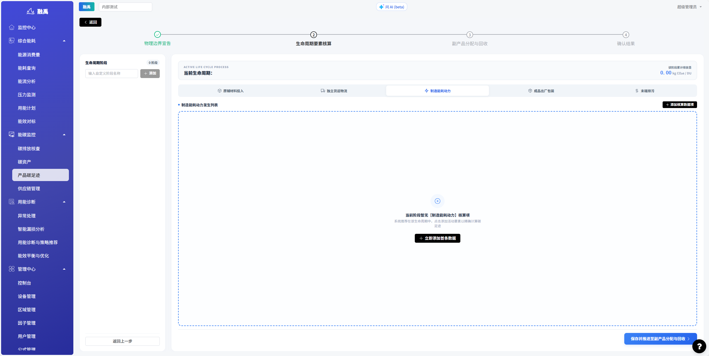

点击**「立即添加首条数据」**弹出能耗配置表单：

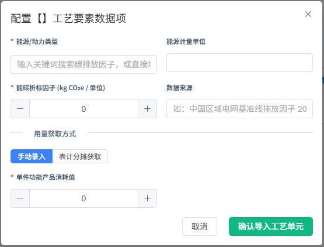

| 字段 | 说明 |
|-----|------|
| 能源/动力类型 | 输入关键词搜索碳排放因子，或手动填写 |
| 能源计量单位 | kWh、m³、GJ等 |
| 能碳折标因子 (kg CO₂e / 单位) | 每单位能源的碳排放量 |
| 数据来源 | 如：中国区域电网基准线排放因子 20XX |
| 用量获取方式 | 手动录入 / 表计分摊获取 |
| 单件功能产品消耗值 | 单件产品消耗的能源数量 |

**常见能源碳排放因子参考值：**

| 能源类型 | 碳排放因子 | 单位 |
|---------|-----------|------|
| 外购电力（网电） | 0.5788 ~ 2.0 | kg CO₂e/kWh |
| 天然气 | 2.162 | kg CO₂e/m³ |
| 柴油 | 3.096 | kg CO₂e/kg |
| 蒸汽 | 0.11 | kg CO₂e/MJ |

#### 4.2.4 成品出厂包装

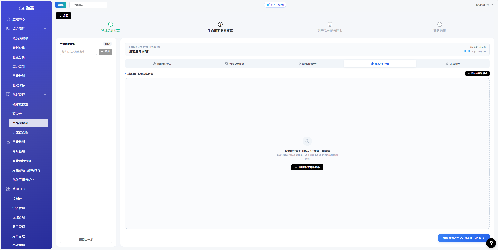

点击**「立即添加首条数据」**弹出包装配置表单：

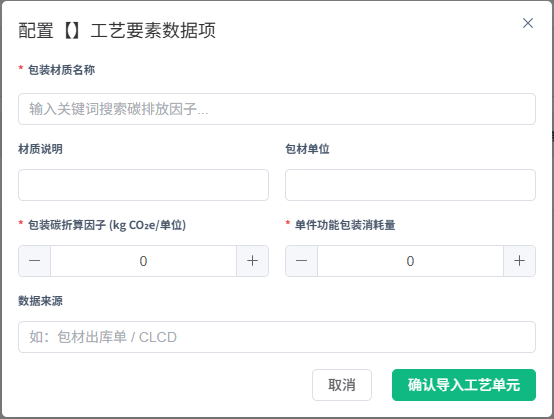

| 字段 | 说明 |
|-----|------|
| 包装材质名称 | 输入关键词搜索碳排放因子，或手动填写 |
| 材质说明 | 包装材料规格描述 |
| 包材单位 | 个、kg、m²等 |
| 包装碳折算因子 (kg CO₂e/单位) | 每单位包装的碳排放量 |
| 单件功能包装消耗量 | 单件产品消耗的包装数量 |
| 数据来源 | 如：包材出库单 / CLCD |

#### 4.2.5 末端排污

记录生产过程中废弃物处理产生的碳排放。操作流程与上述标签页类似，点击对应标签页后添加数据项即可。

---

### 4.3 副产品分配与回收

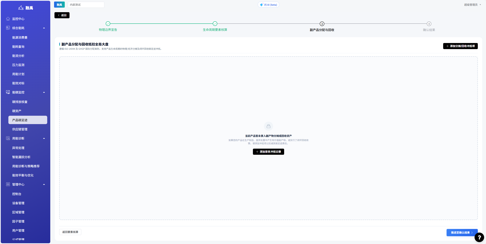

本页面遵循 ISO 14044 及 GHGP 国际分配准则，支持产品生命周期的物理/经济分摊及闭环回收碳足迹冲抵。

- 点击右上角**「添加分摊/回收冲抵项」**添加记录
- 或点击中间的**「添加首条冲抵记录」**
- 完成录入后点击**「推进至确认结果」**进入下一步

> 📌 **注意**：副产品回收会从总碳足迹中抵扣，降低产品整体碳足迹值。
>
> 碳抵扣计算：`碳抵扣 = 回收量 × 碳排放因子 × 回收处理系数`

---

### 4.4 确认结果（核算总览）

#### 4.4.1 PCF生命周期收支平衡大盘


确认结果页面展示三大核心指标：

| 指标 | 说明 |
|-----|------|
| **生命周期总碳排 (Gross Footprint)** | 各工艺阶段碳排放总量 |
| **副产品与回收冲抵减免额 (Offsets)** | 通过副产品回收减少的碳排放（负值） |
| **生命周期PCF净足迹 (Net Footprint)** | 总碳排 - 冲抵减免 = 最终产品碳足迹 |

> 💡 PCF净足迹 = 工艺阶段总碳排放量 - 共生分配/回收抵扣量。该结果将在锁定发布后同步生成碳标签溯源档案。

#### 4.4.2 排放源明细表

页面下方的**排放源明细·按生命周期**表格，按阶段列出所有排放源：

| 列 | 说明 |
|---|------|
| 生命周期阶段 | 所属阶段名称 |
| 排放类型 | 原辅材料/能耗/货运/包装等 |
| 排放源名称 | 具体材料或能源名称 |
| 消耗量 | 数量 |
| 排放因子 | 单位碳排放因子值 |
| 碳排放量 (kg CO₂e) | 该排放源的碳排放量 |
| 排放占比 | 占总碳足迹的比例 |
| 数据来源 | 数据出处 |

可点击右上角**「导出 Excel」**下载明细数据。

确认无误后，点击右下角**「确认锁定并同步至碳足迹大盘」**完成核算。

#### 4.4.3 产品碳足迹核查页面（已审计产品）

核算锁定后，点击产品卡片的**「下钻分析」**进入核查页面：

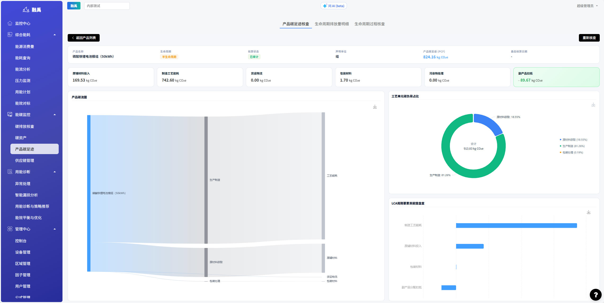

核查页面包含三个标签页：

| 标签页 | 内容 |
|--------|------|
| **产品碳足迹核查** | 各阶段碳排汇总卡片 + 产品碳流图 + 工艺单元碳负荷占比图 |
| **生命周期排放量明细** | 逐项排放数据明细表 |
| **生命周期过程核查** | 核算过程审计记录 |

**产品碳流图**：Sankey图可视化展示碳足迹从原材料获取到生产制造的流向，帮助识别主要排放环节。

**工艺单元碳负荷占比**：环形图直观展示各阶段碳排放占比（如原材料获取18.55%、生产制造81.26%、包装处理0.19%）。

如需修改已审计数据，点击页面右上角**「重新核查」**解锁后重新编辑。
