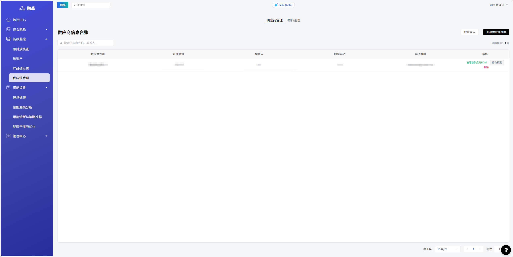
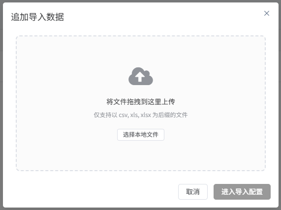
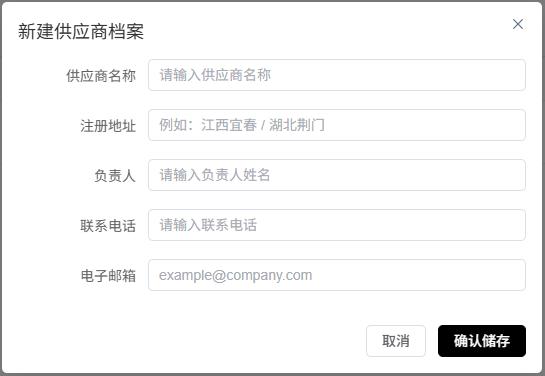
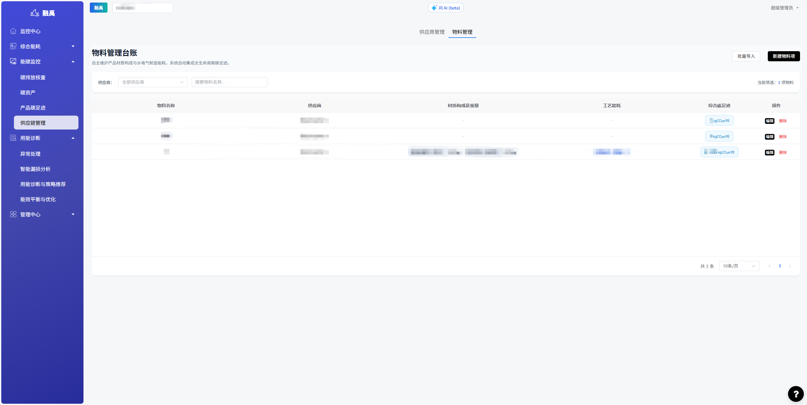
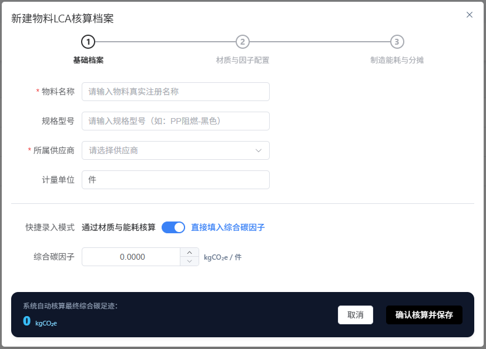

# 供应链管理

## 功能概述

供应链管理模块用于管理供应链上下游的碳排放相关数据，涵盖供应商信息台账管理和物料信息管理两大板块。通过建立完善的供应商档案和物料碳排放数据，企业可以准确核算供应链的间接排放，推动绿色供应链建设。

## 核心功能

### 1. 子标签页导航

页面顶部提供 2 个子标签页：

| 标签页 | 说明 |
|--------|------|
| **供应商管理**（默认） | 管理供应商基本信息台账，维护供应商联系信息与合作档案 |
| **物料管理** | 管理物料清单及其对应的碳排放因子数据 |

### 2. 供应商信息台账

#### 2.1 搜索功能

页面顶部提供搜索框，支持以下搜索方式：

- 按**供应商名称**模糊搜索
- 按**联系人姓名**模糊搜索

#### 2.2 供应商列表表格

表格展示所有已登记的供应商信息，字段说明如下：

| 列名 | 说明 |
|------|------|
| **供应商名称** | 供应商的企业全称 |
| **注册地址** | 供应商的企业注册地址 |
| **负责人** | 供应商的主要联系人/负责人姓名 |
| **联系电话** | 负责人的联系电话 |
| **电子邮箱** | 负责人的电子邮箱地址 |
| **操作** | 编辑、删除等管理操作入口 |

#### 2.3 功能按钮

| 按钮 | 说明 |
|------|------|
| **批量导入** | 支持通过 Excel 文件批量导入多个供应商信息 |
| **新建供应商档案** | 手动创建单个供应商信息记录 |

### 3. 物料管理

切换到「物料管理」标签后，可查看和管理物料的碳排放相关数据，包括物料名称、类别、碳排放因子等信息。

---

## 使用指南

### 场景1：新建单个供应商档案

1. 进入「供应链管理」页面，确认当前在「供应商管理」标签
2. 点击「新建供应商档案」按钮
3. 在弹出的表单中填写以下信息：
   - **供应商名称**：企业全称（必填）
   - **注册地址**：企业注册地址（必填）
   - **负责人**：主要联系人姓名（必填）
   - **联系电话**：联系人电话（必填）
   - **电子邮箱**：联系人邮箱（选填）
4. 确认信息无误后提交保存
5. 新供应商将出现在列表末尾

### 场景2：批量导入供应商

1. 点击「批量导入」按钮
2. 下载导入模板（如有提供），按模板格式准备供应商数据
3. 上传填好的 Excel 文件
4. 系统解析文件内容，预览导入数据
5. 确认数据无误后执行导入
6. 导入完成后，新供应商将批量添加到列表中

### 场景3：搜索供应商

1. 在搜索框中输入供应商名称或联系人姓名关键词
2. 列表将实时过滤，展示匹配的供应商记录
3. 清空搜索框恢复显示全部供应商

### 场景4：编辑供应商信息

1. 在供应商列表中找到目标供应商
2. 点击「操作」列中的「编辑」按钮
3. 在弹出的编辑表单中修改需要更新的字段
4. 确认修改后保存

