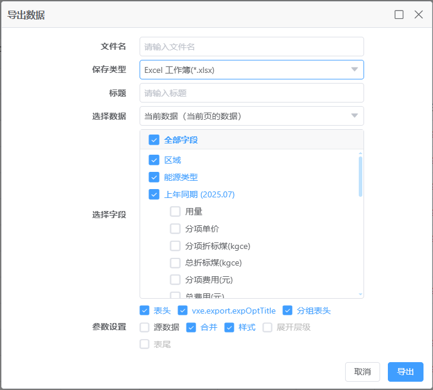

# 能源消费量

## 功能概述

核心能耗报表页面，按区域、能源类型展示能耗月/年/日报表，支持同比环比分析。

## 核心功能

### 1. 双视图模式切换

系统提供两种数据视图，满足不同分析场景：

- **能源消费量强度计算**：以数据表格形式展示各区域能耗明细，支持同比环比分析
- **能源消费量分析**：以图表可视化形式展示能耗分布、趋势和占比

每个视图包含三项核心能力：

- 能耗总量统计（折标煤 / 费用）
- 同比环比分析（增长率 / 变化量）
- 多维度筛选（区域 / 能源类型 / 时间）

### 2. 报表类型切换

系统提供三种时间粒度的能耗报表，满足不同维度的分析需求：

**月报表视图**

- 展示当月各区域各能源类型的能耗数据
- 适合月度能耗盘点和环比分析

**年报表视图**

- 展示全年累计能耗数据
- 适合年度能耗总结和同比分析

**日报表视图**

- 展示每日能耗明细数据
- 适合日常能耗监控和异常追踪

### 3. 多维筛选与单位切换

系统提供灵活的筛选功能，满足个性化数据查看需求：

- **日期选择**：选择统计月份 / 年份 / 日期
- **单位切换**：kgce（千克标准煤）/ tce（吨标准煤）一键切换
- **表格布局**：紧凑 / 标准 / 宽松三种布局可选
- **列设置**：自定义表格显示列
- **区域配置**：管理显示的区域范围

### 4. 数据明细表格

能耗月报表以结构化表格展示完整数据，实际界面如下：
.png)

### 5. 可视化分析图表

能源消费量分析视图提供多维度图表分析，实际界面如下：

分析视图包含 **5个子标签页**：总览 / 能耗结构分析 / 重点设备能耗分析 / 指标分析 / 能源成本分析

**总览页面内容：**

- **2026年累计综合能耗**：显示本年度累计能耗值（tce），对比去年同期数据，标注同比变化百分比。点击「查看组成」可查看能耗构成明细
- **能耗计划预警**：支持月度 / 季度 / 年度三种预警维度，展示当前计划完成情况。无计划时显示「暂无当前月度计划」并提供「创建计划」入口
- **能耗趋势分析**：
  - 时间粒度：月 / 季 / 年
  - 图表类型：折线图 / 柱状图
  - 数据分类：水 / 电 / 气（图例区分颜色）
  - 对比方式：无对比 / 同比 / 环比
  - 支持导出图表
  - 横轴显示最近13个月的能耗数据，柱形堆叠展示水/电/气占比

### 6. 数据导出

- 支持将报表数据导出为 Excel 文件
- 导出文件包含完整字段信息
- 文件名自动包含统计日期
