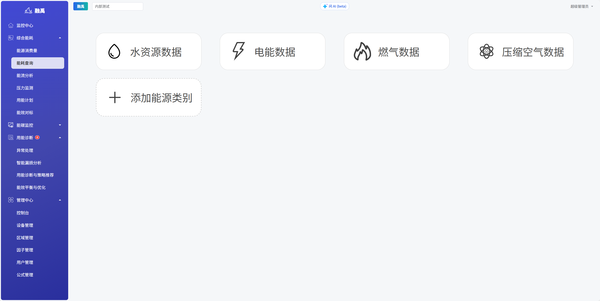
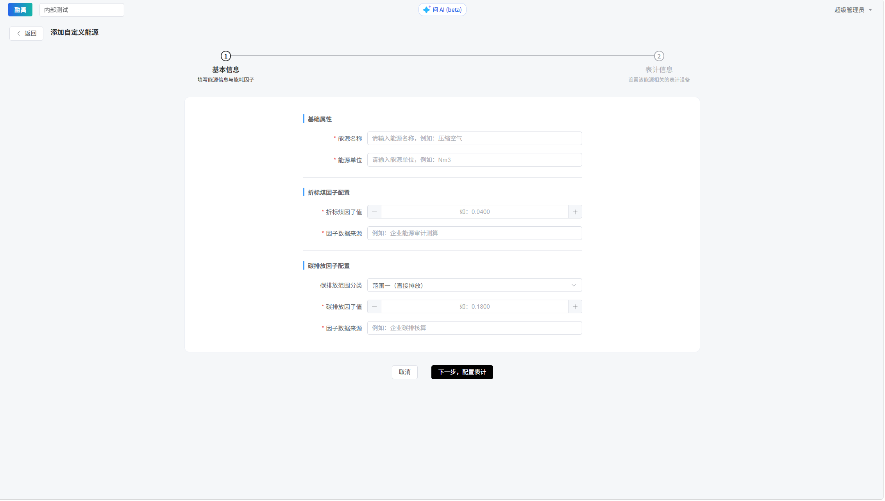

# 能耗查询

## 功能概述

能耗查询模块是智慧能源碳排信息管理平台的数据查询核心入口。页面采用**卡片式布局**，将水、电、燃气三大能源类型分别展示为独立功能卡片，用户可快速选择目标能源类型进入对应的详细查询页面。同时支持**添加新能源类别**，满足多样化的能源管理需求。

## 核心功能

### 1. 详细查询页面（通用）

点击任一能源类型卡片后进入的详细数据查询页面，提供完整的筛选与展示功能。

| 功能项 | 说明 |
|--------|------|
| 时间范围选择 | 支持按日、周、月、季度、年度等维度选择查询时间段 |
| 区域筛选 | 按一级区域、二级区域层级选择查看范围 |
| 数据表格 | 展示各时间节点、各区域的能耗数值明细 |
| 趋势图表 | 以折线图或柱状图展示能耗变化趋势 |
| 数据导出 | 支持将查询结果导出为 Excel 或 CSV 格式 |

### 2. 添加能源类别

页面右侧扩展卡片，用于配置新的能源类型。

| 项目 | 说明 |
|------|------|
| 卡片标题 | 添加能源类别 |
| 图标 | "+"号图标 |
| 功能 | 配置新能源数据类别（如蒸汽、太阳能、地热等） |
| 操作流程 | 点击后弹出配置表单，填写能源名称、单位、数据来源等信息 |

## 水资源数据

### 1. 智能报表

#### 1.1 报表类型选择

系统提供四种报表类型：
- **日抄表记录**：查看每日水表读数记录
- **日统计报表**：按日汇总的用水统计数据
- **月统计报表**：按月汇总的用水统计数据
- **按时段按日报表**：查看特定时段内的详细用水数据

#### 1.2 日抄表记录

- **日期选择**：选择需要查看的具体日期
- **视图切换**：根据需要切换紧凑、标准、宽松等视图模式
- **数据内容**：系统显示各监测点的详细数据，包括：
  - 监测点编号和水表编号
  - 水表规格型号
  - 上次读数和本次读数(m³)
  - 读数记录时间
  - 用水流量(m³)

#### 1.3 日统计报表

- **时间范围**：选择需要查看的日期区间
- **不明水率**：系统自动计算并显示不明水率
- **数据内容**：查看各测点每日的用水流量和读数
- **汇总数据**：底部自动显示一级、二级用水总计

#### 1.4 月统计报表

- **月份选择**：选择需要查看的年月范围
- **数据内容**：查看各监测点每月的读数和流量数据
- **汇总信息**：底部显示月度汇总数据和总不明水率

#### 1.5 2级以上水表数据查询

- 以对话框形式呈现二级及以上水表数据
- 清晰展示各级水表的层级关系和详细用水数据

#### 1.6 按时段按日报表     

- **表计选择**：通过左侧树形结构选择需要查看的表计
- **时间选择**：自定义选择需要查看的时间段
- **数据展示**：系统按时间顺序展示读数和流量数据
- **数据导出**：一键导出查询结果，方便保存和分析

### 2. 用水数据中心

#### 2.1 概览仪表板

仪表板提供三个关键指标的实时监控：
- **昨日用水总量**：显示前一天的总用水量
- **本月用水总量**：当月累计用水量
- **本年用水总量**：年度累计用水量

每个指标配有相应的趋势图，直观展示用水变化情况。

#### 2.2 数据可视化与分析工具

系统提供丰富的图表样式和分析维度：

##### 2.2.1 时间维度选择 
- 支持按**时、星期、日、月、季度、年**等多个时间维度查看数据

> 按月统计和按日统计增加不明水率的展示

按周统计时显示连续四周用水量对比

按时显示数据会展示昨日每小时的分时用水量

**注意：系统的分时用水量只有选择具体的表计才能使用**

##### 2.2.2 对比分析功能

- **对比**选项：可选择"不对比"、"上个周期"、"去年同期"或"自定义"时间段进行数据对比

##### 2.2.3 详细数据图表
- **柱状图与折线图结合**：展示日用水量（蓝色柱状）和不明水率（灰线）
- **统计指标显示**：包括最大值、平均值、最小值等关键统计数据

#### 2.3 选择具体表计选择功能

系统支持筛选不同表计：
- **选择模式**：全部或选择具体表计
- **层级结构**：采用树形结构表计

### 2.4 按区域统计功能

#### 2.4.1 区域用水量

- **多维度时间选择**：支持按月、按季度、按年查看数据
- **饼图可视化**：直观展示各区域用水量占比情况
- **重点区域标注**：重点标注主要用水区域
- **数据导出**：支持将图表数据导出保存

#### 2.4.2 区域用水趋势

- **动态趋势分析**：展示选定区域在某一时间段内的用水量变化趋势
- **时间粒度选择**：支持按日、月、季、年查看趋势数据
- **区间筛选**：可选择特定区域（如图中的"A区办公楼"）进行分析

#### 2.4.3 区域用水排名

- **直观排名展示**：通过水平条形图展示各区域用水量排名
- **时间维度选择**：支持按本月、本季度、本年查看排名情况
- **数据对比分析**：可对比不同时间段的排名变化

#### 2.4.4 区域用水台账

- **详细数据记录**：展示各区域每日详细用水量数据
- **时间区间选择**：可自定义查询时间范围
- **数据导出**：支持将台账数据导出为Excel格式

### 2.5 按用途统计功能

#### 2.5.1 用途用水量

- **用水类型分布**：通过饼图直观展示不同用途的用水量占比
- **多时间维度**：支持按月、季度、年查看不同用途用水分布
- **图表交互**：可悬浮查看详细数据

#### 2.5.2 用途用水数据

- **趋势变化分析**：折线图展示特定用途在一段时间内的用水变化趋势
- **用途筛选**：可从下拉菜单中选择特定用途（如"工业"）查看趋势
- **时间粒度灵活**：支持按日、月、季、年查看趋势数据

#### 2.5.3 用途用水排名

- **用途排名对比**：水平条形图直观展示不同用途的用水量大小
- **数值显示**：悬浮显示具体用水量数值，便于精确对比
- **时间维度选择**：支持选择不同时间维度查看排名

#### 2.5.4 用途用水台账           

- **详细日期记录**：按日期记录各用途的详细用水量
- **数据导出**：一键导出台账数据，支持多种格式
- **自定义时间**：可自定义查询时间范围进行分析

### 3.水衡管理系统

#### 3.1水平衡可视化

这是系统的核心可视化界面：
- 以流程图形式展示整个供水网络的结构和关系
- 中心节点为水源入口
- 从中心向各个用水区域分配水流
- 使用不同颜色的连线表示转水和排水的流向
- 每个节点显示进水量(Vi)、转水量(Vco)和排水量(Vd)
- 底部展示水平衡计算公式：
  - 取水量 = 排水量 + 转水量 + 漏损水量

#### 3.2 区域配置管理

这个页面用于管理系统中已配置的不同区域：
- 页面顶部有创建新合并区域，能够将多个现有区域合并为一个新区域
- 每个区域卡片显示：
  - 区域名称
  - 总流量数据
  - 排水比例和转水比例
- 点击编辑比例按钮，弹出编辑比例窗口：
  - 重新编辑排水比例和耗水比例参数

#### 3.3 新建合并区域

这是一个弹出窗口，用于创建新的合并区域功能：
- 用户输入新区域的名称
- 提供区域选择功能，可选择多个现有区域进行合并
- 设置排水比例和转水比例参数
- 提供确认和取消操作按钮

## 电能数据

### 1. 智能报表

#### 1.1 报表类型选择

系统提供四种报表类型：
- **日抄表记录**：查看每日电表读数记录
- **日统计报表**：按日汇总的用电统计数据
- **月统计报表**：按月汇总的用电统计数据
- **按时段按日报表**：查看特定时段内的详细用电数据

#### 1.2 日抄表记录

- **日期选择**：选择需要查看的具体日期
- **视图切换**：根据需要切换紧凑、标准、宽松等视图模式
- **数据内容**：系统显示各监测点的详细数据，包括：
  - 监测点编号和电表编号
  - 电表规格型号
  - 上次读数和本次读数(m³)
  - 读数记录时间
  - 用电用量(m³)

#### 1.3 日统计报表

- **时间范围**：选择需要查看的日期区间
- **数据内容**：查看各测点每日的用电用量和读数

#### 1.4 月统计报表

- **月份选择**：选择需要查看的年月范围
- **数据内容**：查看各监测点每月的读数和用量数据

#### 2.1 2级以上电表数据查询

- 以对话框形式呈现二级及以上电表数据
- 清晰展示各级电表的层级关系和详细用电数据

#### 2.2 按时段按日报表

- **表计选择**：通过左侧树形结构选择需要查看的表计。
- **时间选择**：支持自定义选择查看的时间范围。
- **数据展示**：系统按时间顺序展示表计数据，可自定义展示以下基础信息：

  - **时间**  
  - **读数**  
  - **用量**  
  - **电压**：A相电压、B相电压、C相电压、AB线电压、BC线电压、AC线电压  
  - **电流**：A相电流、B相电流、C相电流、漏电流  
  - **功率**：总有功功率、总无功功率、总视在功率  
  - **电能**：总有功电能、总无功电能、总视在电能  
  - **其他**：功率因数、频率  
- **数据导出**：支持一键导出查询结果为文件

### 2. 用电数据中心

#### 2.1 概览仪表板

仪表板提供三个关键指标的实时监控：
- **昨日用电总量**：显示前一天的总用电量
- **本月用电总量**：当月累计用电量
- **本年用电总量**：年度累计用电量

每个指标配有相应的趋势图，直观展示用电变化情况。

#### 2.2 数据可视化与分析工具

系统提供丰富的图表样式和分析维度：

#### 2.2.1 时间维度选择
- 支持按**时、星期、日、月、季度、年**等多个时间维度查看数据

按周统计时显示连续四周用电量对比

按时显示数据会展示昨日每小时的分时用电量

**注意：系统的分时用电量只有选择具体的表计才能使用**

#### 2.2.2 对比分析功能     

- **对比**选项：可选择"不对比"、"上个周期"、"去年同期"或"自定义"时间段进行数据对比

#### 2.2.3 详细数据图表
- **柱状图与折线图结合**：展示日用电量（蓝色柱状）
- **统计指标显示**：包括最大值、平均值、最小值等关键统计数据

#### 2.2.4 选择具体表计选择功能

系统支持筛选不同表计：
- **选择模式**：全部或选择具体表计
- **层级结构**：采用树形结构展示表计层级关系

#### 2.3 按区域统计功能

#### 2.3.1 区域用电量

- **多维度时间选择**：支持按月、按季度、按年查看数据
- **饼图可视化**：直观展示各区域用电量占比情况
- **重点区域标注**：重点标注主要用电区域
- **数据导出**：支持将图表数据导出保存

#### 2.3.2 区域用电趋势

- **动态趋势分析**：展示选定区域在某一时间段内的用电量变化趋势
- **时间粒度选择**：支持按日、月、季、年查看趋势数据
- **区间筛选**：可选择特定区域（如图中的"研发楼"）进行分析

#### 2.3.3 区域用电排名

- **直观排名展示**：通过水平条形图展示各区域用电量排名
- **时间维度选择**：支持按本月、本季度、本年查看排名情况
- **数据对比分析**：可对比不同时间段的排名变化

#### 2.3.4 区域用电台账

- **详细数据记录**：展示各区域每日详细用电量数据
- **时间区间选择**：可自定义查询时间范围
- **数据导出**：支持将台账数据导出为Excel格式

#### 2.4 按用途统计功能

#### 2.4.1 用途用电量

- **用电类型分布**：通过饼图直观展示不同用途的用电量占比
- **多时间维度**：支持按月、季度、年查看不同用途用电分布
- **图表交互**：可悬浮查看详细数据

#### 2.4.2 用途用电数据

- **趋势变化分析**：折线图展示特定用途在一段时间内的用电变化趋势
- **用途筛选**：可从下拉菜单中选择特定用途（如"工业"）查看趋势
- **时间粒度灵活**：支持按日、月、季、年查看趋势数据

#### 2.4.3 用途用电排名     

- **用途排名对比**：水平条形图直观展示不同用途的用电量大小
- **数值显示**：悬浮显示具体用电量数值，便于精确对比
- **时间维度选择**：支持选择不同时间维度查看排名

#### 2.4.4 用途用电台账

- **详细日期记录**：按日期记录各用途的详细用电量
- **数据导出**：一键导出台账数据，支持多种格式
- **自定义时间**：可自定义查询时间范围进行分析

