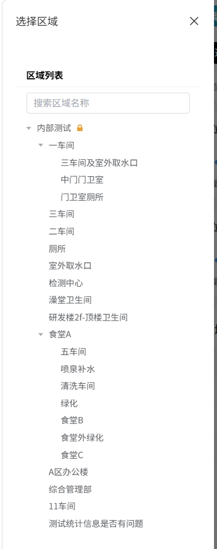
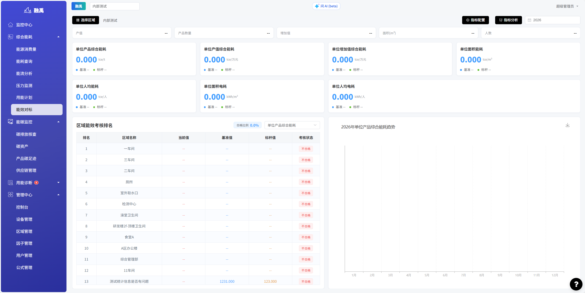

# 能效对标

## 功能概述

能效对标模块提供多维度能效指标的对标分析功能，支持区域考核排名。通过设定基准值和标杆值，帮助用户评估各区域的能效水平，发现节能改进空间，推动能效管理的持续优化。

## 核心功能

### 1. 顶部功能区域

提供区域选择、指标配置、指标分析和年份筛选等核心操作入口。

**界面元素说明：**

| 元素 | 类型 | 说明 |
|------|------|------|
| 选择区域 | 下拉选择框 | 选择需要查看和分析的目标区域 |
| 指标配置 | 按钮 | 点击后进入指标配置界面，可自定义能效指标项及基准/标杆值 |
| 指标分析 | 按钮 | 点击后进入详细分析页面，对当前能效指标进行深度分析 |
| 年份选择 | 年份选择器 | 选择需要对标分析的年份，默认为当前年份 |

### 2. 基础数据指标

展示当前区域的基础运营数据，作为能效指标计算的底层数据支撑。

| 指标名称 | 单位 | 说明 |
|----------|------|------|
| 产值 | 万元 | 区域内企业/产线的总产值 |
| 产品数量 | 吨/件等 | 区域内的产品产量 |
| 增加值 | 万元 | 区域的工业增加值 |
| 面积 | m² | 区域的建筑面积或使用面积 |
| 人数 | 人 | 区域内的工作人员数量 |

> **说明**：基础数据是计算单位能效指标的分子/分母依据，确保基础数据的准确性对能效对标结果至关重要。

### 3. 能效指标卡片

以卡片形式展示 7 项核心能效指标，每张卡片同时显示当前值、基准值和标杆值，便于快速判断能效水平。

| 指标名称 | 单位 | 含义说明 |
|----------|------|----------|
| 单位产品综合能耗 | tce/t | 每吨产品消耗的综合能源量（折标准煤） |
| 单位产值综合能耗 | tce/万元 | 每万元产值消耗的综合能源量 |
| 单位增加值综合能耗 | tce/万元 | 每万元增加值消耗的综合能源量 |
| 单位面积能耗 | tce/m² | 每平方米面积消耗的能源量 |
| 单位人均能耗 | tce/人 | 每人平均消耗的能源量 |
| 单位面积电耗 | kWh/m² | 每平方米面积消耗的电量 |
| 单位人均电耗 | kWh/人 | 每人平均消耗的电量 |

**卡片显示规则：**
- 每张卡片上方显示当前区域的指标数值
- 卡片下方分两行显示：
  - **基准**：行业或企业设定的最低能效要求，低于此值视为不合格
  - **标杆**：行业或企业设定的优秀能效标准，达到此值视为优秀

**判断逻辑：**
- 当前值 **优于** 标杆值 → 能效水平优秀（绿色标识）
- 当前值 **介于** 基准值与标杆值之间 → 能效水平合格但有改进空间（黄色标识）
- 当前值 **劣于** 基准值 → 能效水平不合格，需整改（红色标识）

### 4. 区域能效考核排名表

以表格形式展示各区域的能效考核排名，直观呈现各区域的对标情况。

**表格字段说明：**

| 字段 | 说明 |
|------|------|
| 排名 | 按能效水平从高到低排列，排名越靠前表示能效越好 |
| 区域名称 | 被考核区域的名称 |
| 当前值 | 该区域在当前指标下的实际能效值 |
| 基准值 | 该指标的最低合格标准 |
| 标杆值 | 该指标的优秀标准 |
| 考核状态 | 「合格」表示当前值优于基准值；「不合格」表示当前值劣于基准值，需重点关注并整改 |

### 5. 年度趋势图

以折线图形式展示年度内各月单位产品综合能耗的变化趋势。

**图表说明：**
- 横轴：1月至12月
- 纵轴：单位产品综合能耗（tce/t）
- 折线走势反映全年各月能效变化情况
- 可辅助判断能效改善措施的效果及季节性波动规律

---
