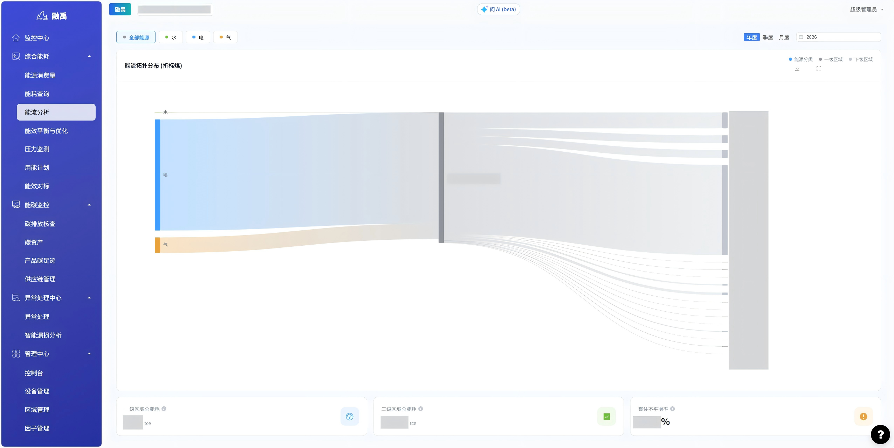

# 能流分析

## 功能概述

能流分析模块利用**桑基图（Sankey Diagram）** 对能源在建筑系统内的流动与分配进行可视化呈现。用户可直观了解各类能源从供应端到各级区域的分配情况，线条粗细代表能耗大小，帮助快速识别高耗能路径和异常分流，为节能优化提供数据支撑。

## 核心功能

### 1. 筛选条件区

页面顶部筛选栏，用于设定能流分析的查询条件。
.png)
| 筛选项 | 可选值 | 说明 |
|--------|--------|------|
| 能源类型 | 全部、水、电、气 | 选择要分析的能源种类 |
| 时间粒度 | 年度、季度、月度 | 选择统计的时间维度 |
| 年份选择 | 可选年份列表 | 选择具体年份 |

### 2. 能流拓扑分布图（折标煤）

页面核心可视化区域，以桑基图形式展示能源从供应到各区域的流向分布。

**图表结构：**

| 层级 | 位置 | 说明 |
|------|------|------|
| 能源分类 | 左侧 | 展示各类能源（自来水、电力、天然气等）作为能源供给源头 |
| 一级区域 | 中间 | 展示一级区域（如：A栋、B栋、公共区域等）作为能源首次分配节点 |
| 二级区域 | 右侧 | 展示二级区域（如：各楼层、各功能区）作为能源最终消耗节点 |

**图表要素说明：**

| 要素 | 说明 |
|------|------|
| 节点方块 | 代表能源来源或区域，高度与该节点能耗总量成正比 |
| 连接线条 | 从左向右流动，线条粗细代表该路径上的能耗量大小 |
| 颜色编码 | 不同能源类型使用不同颜色区分 |
| 单位 | 所有数值统一折算为标准煤当量（tce） |

### 3. 底部统计卡片

页面底部展示关键统计指标，辅助判断系统平衡状态。
.png)
| 卡片名称 | 说明 |
|----------|------|
| 一级区域总能耗（tce） | 所有一级区域能耗合计值 |
| 二级区域总能耗（tce） | 所有二级区域能耗合计值 |
| 整体不平衡率 | 一级与二级能耗的差异比率，反映计量与分配的一致程度 |

