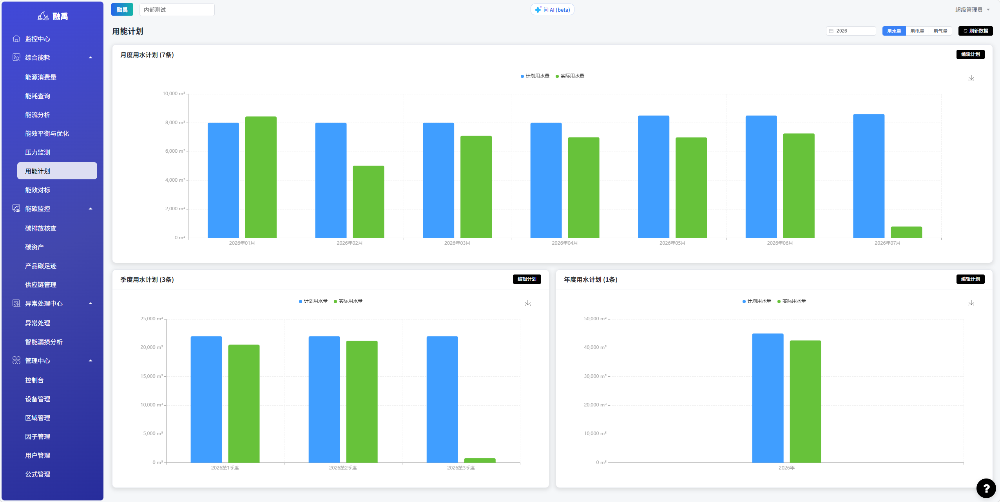
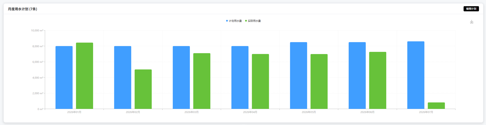
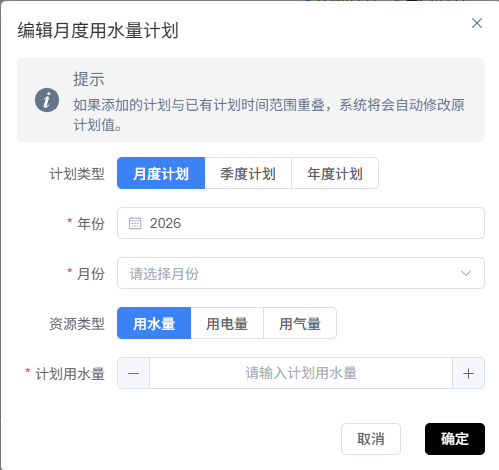
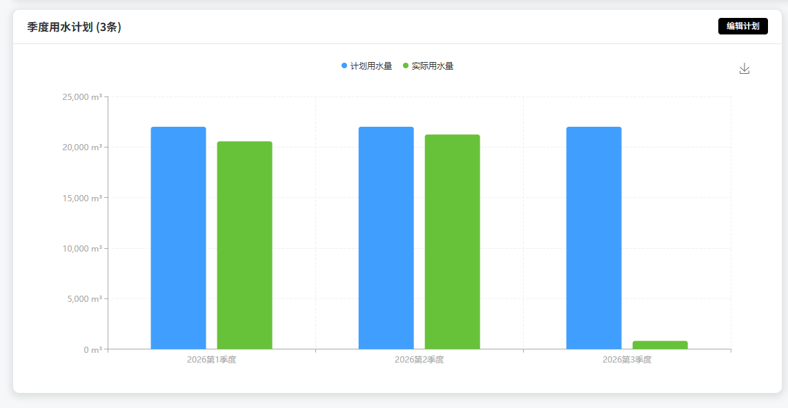
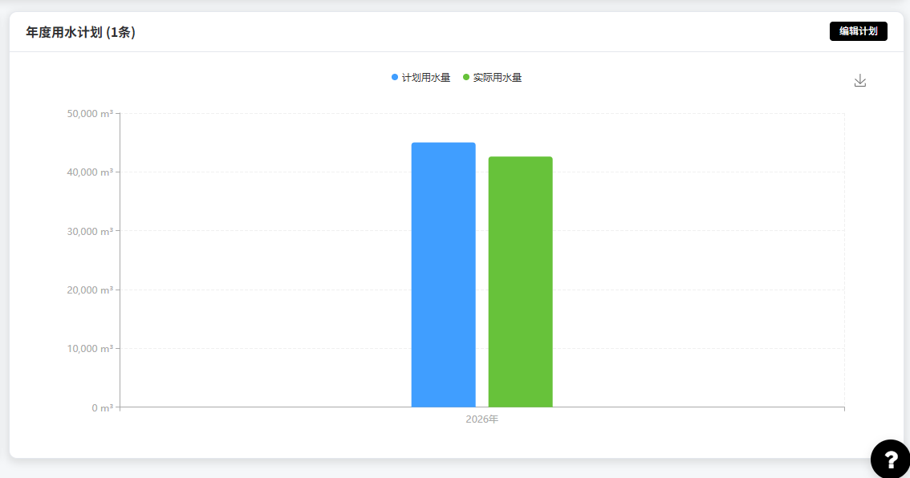

# 用能计划

## 功能概述

用能计划模块用于制定和跟踪企业用能计划，支持计划值与实际值的多维度对比分析。通过月度、季度、年度三个层级的计划管理，帮助用户合理控制用水、用电、用气量，及时发现用量偏差，保障用能目标的达成。
  

## 核心功能
### 1. 筛选条件与能源类型切换

提供年份选择和能源类型切换功能，支持在不同维度间灵活切换查看。

**界面元素说明：**

| 元素 | 类型 | 说明 |
|------|------|------|
| 年份选择 | 年份选择器 | 选择需要查看或编辑的年份，默认为当前年份 |
| 能源类型 | 标签切换 | 包含「用水量」「用电量」「用气量」三个标签，点击切换对应能源类型的计划数据 |
| 刷新数据 | 按钮 | 根据当前筛选条件重新加载计划数据 |

### 2. 月度计划管理

以列表形式展示和管理月度用能计划，支持计划的查看与编辑。

**界面元素说明：**

| 元素 | 说明 |
|------|------|
| 月度计划列表 | 显示当前年份和能源类型下各月的计划数据，共 X 条记录 |
| 编辑计划 | 点击后进入计划编辑模式，可修改各月计划值 |

### 3. 季度计划对比图表

以柱状图形式直观展示季度计划用量与实际用量的对比情况。

**图表说明：**
- 横轴：Q1（第一季度）、Q2（第二季度）、Q3（第三季度）、Q4（第四季度）
- 纵轴：用能量
- 柱状图组：每季显示两根柱，分别代表「计划用水量」和「实际用水量」
- 通过柱高对比可直观判断各季度是否完成计划目标

### 4. 年度计划对比图表

以柱状图形式展示年度计划用量与实际用量的总体对比。

**图表说明：**
- 横轴：年度汇总
- 纵轴：用能量
- 柱状图组：显示「计划用水量」和「实际用水量」两根柱
- 用于宏观评估全年用能计划的整体完成情况

