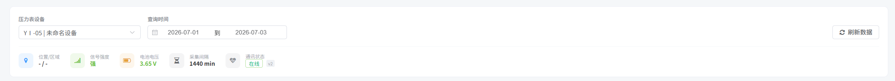
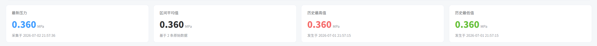
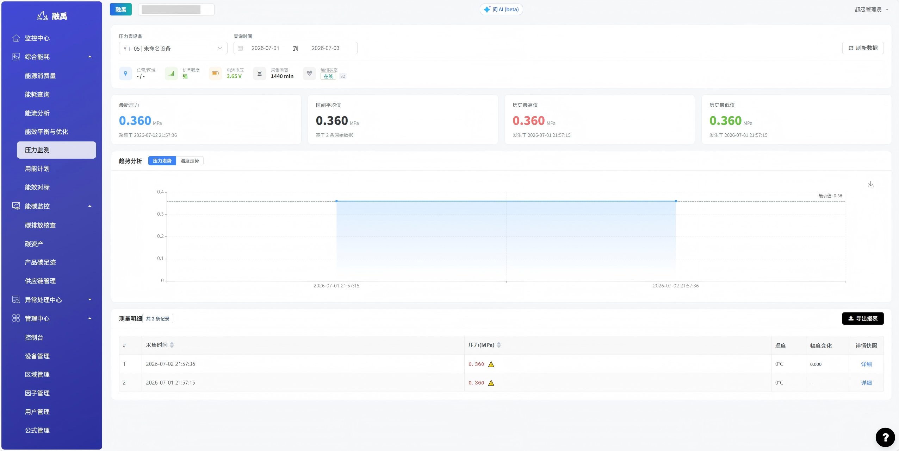
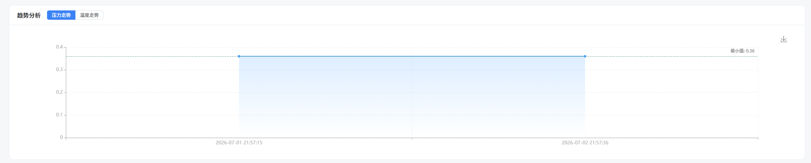
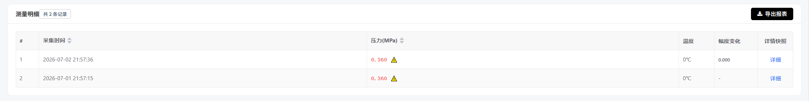

# 压力监测

## 功能概述

压力监测模块用于实时监测管网压力状态，帮助用户全面掌握管网运行压力情况。模块支持历史数据回溯与趋势分析，可辅助运维人员及时发现压力异常、排查管网隐患，保障管网安全稳定运行。

## 核心功能
### 1. 设备筛选与时间范围查询

提供压力表设备选择和时间范围筛选功能，支持精准定位目标设备在指定时段内的压力数据。

**界面元素说明：**

| 元素 | 类型 | 说明 |
|------|------|------|
| 压力表设备 | 下拉选择框 | 从已有压力表设备列表中选择需要查看的设备 |
| 查询时间 | 日期范围选择器 | 选择数据查询的起止日期，支持自定义时间段 |
| 刷新数据 | 按钮 | 点击后根据当前筛选条件重新加载数据 |

### 2. 数据概览卡片

以卡片形式展示关键压力统计指标，便于快速了解压力整体状况。
 
| 卡片名称 | 显示内容 | 颜色标识 | 说明 |
|----------|----------|----------|------|
| 最新压力 | 实时压力值，单位：MPa | 🔵 蓝色 | 当前最新一次采集的压力读数 |
| 区间平均值 | 平均压力值，单位：MPa | 默认色 | 所选时间范围内的平均压力值，卡片下方标注参与计算的原始数据条数 |
| 历史最高值 | 最高压力值，单位：MPa | 🔴 红色 | 所选时间范围内记录到的最大压力值，需重点关注是否超阈值 |
| 历史最低值 | 最低压力值，单位：MPa | 🟢 绿色 | 所选时间范围内记录到的最小压力值，需关注是否存在欠压风险 |

### 3. 趋势分析图表

以折线图形式展示压力或温度随时间的变化趋势，支持多标签切换。

| 标签 | 说明 |
|------|------|
| 压力走势 | 展示选定时间范围内压力值的变化趋势曲线 |
| 温度走势 | 展示选定时间范围内温度值的变化趋势曲线 |

### 4. 测量明细与报表导出

底部区域提供完整的测量数据明细列表，支持数据导出。
