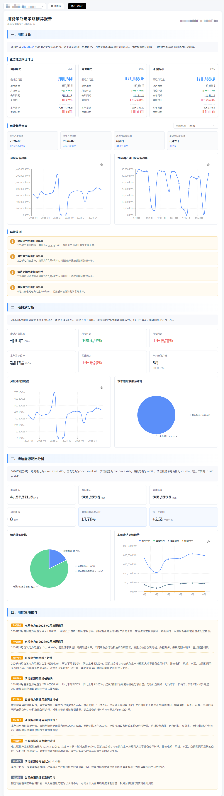

# 用能诊断与策略推荐

## 1. 功能概述

### 1.1 模块定位

「用能诊断与策略推荐」是系统中面向**能源管理决策者**的核心分析模块，用于对主要能源（水、电、天然气等）进行月度环比、同比及年度累计对比分析，识别用能异常趋势，并基于数据驱动的策略推荐帮助管理者制定节能优化方案。

### 1.2 核心功能

| 功能 | 说明 |
|------|------|
| **主要能源同比环比** | 按月对比各能源用量变化，自动标注上升/下降幅度 |
| **用能趋势图表** | 月度峰值、谷值、日度趋势可视化展示 |
| **异常监测** | 识别用能偏离正常范围的时间段 |
| **策略推荐** | 基于历史数据趋势给出节能优化建议 |
| **报告导出** | 支持导出图片和 Word 文档，便于汇报 |

---

## 2. 页面说明

### 2.1 报告主页

页面顶部显示报告标题「用能诊断与策略推荐报告」及最近完整分析月份。右上角提供：
- **组织切换**：下拉选择不同组织/公司
- **导出图片**：将当前报告截图导出
- **导出 Word**：将完整报告导出为 Word 文档

### 2.2 用能诊断

报告正文从「一、用能诊断」开始，说明当前分析月份和数据加载逻辑。

#### 主要能源同比环比

以卡片形式展示每种能源的月度对比数据：

| 指标 | 说明 |
|------|------|
| **最近月用量** | 最近完整月份的实际用量 |
| **上月用量** | 前一个月的实际用量 |
| **月度环比** | 与上月对比的增减百分比（红色=上升，绿色=下降） |
| **去年同期** | 去年同月的实际用量 |
| **月度同比** | 与去年同月对比的增减百分比 |
| **本年累计** | 本年度截至当前的累计用量 |
| **累计同比** | 本年累计与去年同期累计的增减百分比 |

> 💡 系统自动计算环比和同比。当某个指标显示"无可比基数"时，表示对应时期无数据记录，无法进行对比。

#### 用能趋势图表

展示各能源的时间序列趋势：

- **本月月度峰值/谷值**：本月最高和最低的用量月份及数值
- **最近月日度峰值/谷值**：最近月份中日用量的最高和最低日期及数值
- **趋势图**：按月展示能源用量的变化曲线

---

## 3. 操作指南

### 3.1 查看报告

1. 登录系统后，在左侧导航栏展开「用能诊断」
2. 点击「用能诊断与策略推荐」进入报告页面
3. 通过顶部下拉框切换组织，查看不同组织的数据
4. 系统默认加载最近完整月份的月度数据，日度趋势和异常监测随后自动加载

### 3.2 导出报告

- **导出图片**：点击顶部「导出图片」按钮，将当前页面内容保存为图片
- **导出 Word**：点击顶部「导出 Word」按钮，生成完整的 Word 格式报告，包含所有分析内容和图表

### 3.3 数据解读

| 场景 | 说明 |
|------|------|
| 环比大幅上升 | 当月用量显著高于上月，需排查是否存在设备异常或生产负荷增加 |
| 同比大幅下降 | 相比去年同期明显下降，可能是节能措施生效或生产调整 |
| 无可比基数 | 对应时期无数据，常见于新接入的能源类型或新上线的设备 |
