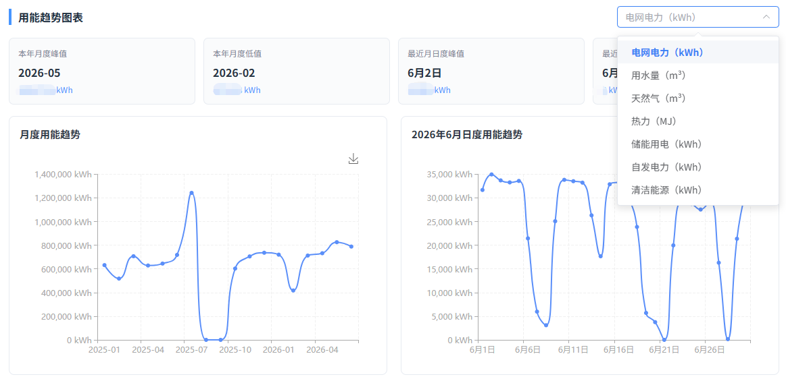
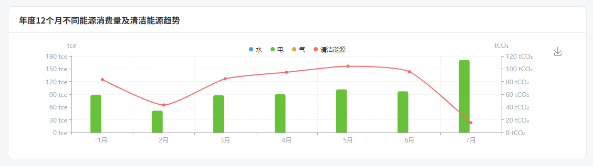
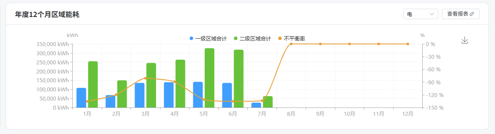

# 能效平衡与优化

## 1. 功能概述

### 1.1 模块定位

「能效平衡与优化」是面向**能源平衡分析**的核心模块，用于监控企业能源供给与消耗之间的平衡关系，分析不同能源品种的消耗结构、清洁能源占比，以及各级区域的能耗分布情况，辅助制定能效优化策略。

### 1.2 核心功能

| 功能 | 说明 |
|------|------|
| **年度综合能耗** | 展示年度总能耗（tce）和光伏发电量 |
| **一级/二级不平衡** | 分析各级能源计量之间的不平衡量 |
| **不平衡率** | 衡量能源计量数据的一致性 |
| **多能源消费趋势** | 年度12个月水、电、气、压缩空气、清洁能源趋势对比 |
| **区域能耗分析** | 按一级/二级区域展示月度能耗及不平衡率 |
| **设备类型能耗占比** | 不同设备类型的能耗结构分析 |

---

## 2. 页面说明

### 2.1 主页面

页面顶部提供年度选择器（默认当前年度），下方展示6个关键指标卡片和多个分析图表。

### 2.2 关键指标卡片

| 指标 | 单位 | 说明 |
|------|------|------|
| **本年度综合能耗** | tce（吨标准煤当量） | 年度总能耗折算为标准煤 |
| **光伏发电量** | tCO₂ | 光伏发电对应的碳减排量 |
| **一级不平衡量** | kWh | 一级计量节点之间的能源不平衡量（负值表示消耗大于供给记录） |
| **二级不平衡量** | 万kWh | 二级计量节点之间的能源不平衡量 |
| **不平衡率** | % | 不平衡量占总能耗的百分比（理想情况接近0） |
| **重点设备能耗** | kWh | 重点监测设备的总能耗 |

> 💡 **不平衡率说明**：不平衡率 = （一级总输入 - 二级总输出）/ 一级总输入 × 100%。负值表示二级计量总和超过一级计量，可能由计量误差、漏损或数据采集不同步引起。

### 2.3 年度12个月不同能源消费量及清洁能源趋势

- **双Y轴图表**：左轴为 tce（标准煤当量），右轴为 tCO₂（碳排放量）
- **图例**：水（蓝色）、电（绿色）、气（橙色）、压缩空气（红色）、清洁能源（灰色）
- 展示各能源品种在12个月内的消费变化趋势

### 2.4 年度12个月区域能耗

- 支持按能源类型筛选（默认"电"）
- **三条曲线**：一级区域合计（蓝色）、二级区域合计（绿色）、不平衡率（橙色）
- 不平衡率右轴以百分比显示
- 右上角「查看报表」链接可跳转详细报表

### 2.5 本年度不同设备类型能耗占比

页面下方的饼图展示各类设备（如生产设备、空调设备、照明设备等）的能耗占比结构。

---

## 3. 操作指南

### 3.1 查看能效数据

1. 在左侧导航栏展开「用能诊断」
2. 点击「能效平衡与优化」
3. 通过顶部年度选择器切换年份（默认当前年）
4. 查看各指标卡片了解年度能效概况

### 3.2 分析能源趋势

- 使用「年度12个月不同能源消费量及清洁能源趋势」图观察各能源品种的月度变化
- 重点关注异常峰值月份，排查是否存在设备故障或生产负荷突变

### 3.3 分析区域能耗

- 在「年度12个月区域能耗」图中切换能源类型（电/水/气等）
- 关注不平衡率曲线，如果某月不平衡率偏离正常范围，需检查该月计量数据质量
- 点击「查看报表」获取区域能耗的详细数据表

### 3.4 优化建议

| 不平衡率情况 | 可能原因 | 建议措施 |
|-------------|---------|---------|
| 接近 0% | 计量数据准确 | 保持当前管理 |
| 轻微偏离（±5%） | 正常计量误差 | 关注趋势变化 |
| 大幅偏离（>10%） | 计量异常或数据缺失 | 检查表计状态、排查漏损 |
| 持续负值 | 二级计量超出一级 | 核查层级关系是否正确 |

---