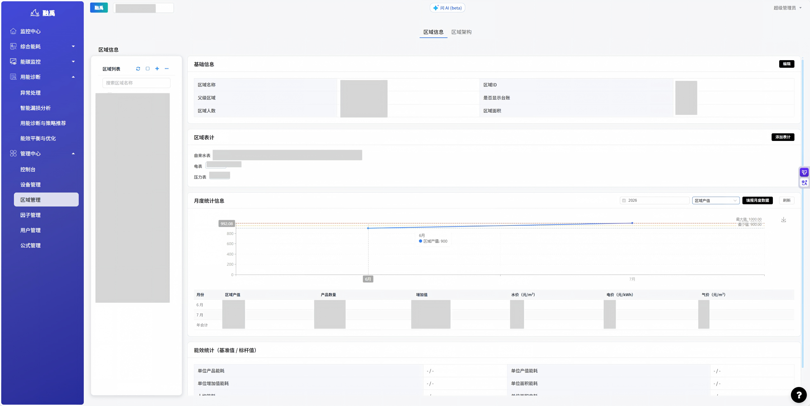
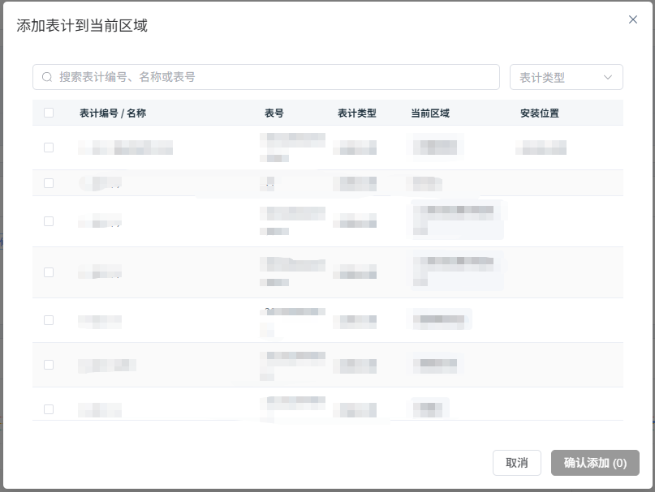
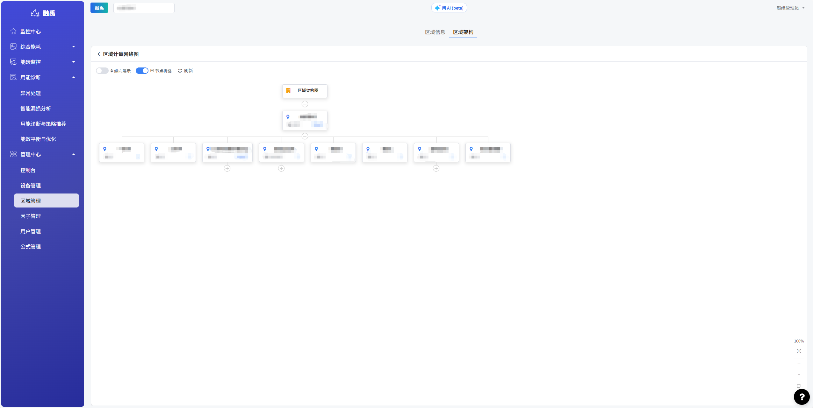

# 区域管理

## 1. 功能概述

### 1.1 模块定位

「区域管理」用于定义和维护企业的物理空间层级结构，将计量设备与具体区域关联，支撑按区域维度的能耗统计、分析和展示。区域架构是能耗数据空间化呈现的基础。

### 1.2 核心功能

| 功能 | 说明 |
|------|------|
| **区域信息管理** | 新增、编辑、删除区域节点 |
| **区域表计关联** | 为区域绑定计量设备 |
| **月度统计信息** | 按月份录入区域产值等统计数据 |
| **区域架构图** | 可视化展示区域层级网络拓扑 |

---

## 2. 页面说明

### 2.1 区域信息页

页面分为**左侧区域列表**和**右侧详情面板**两部分，顶部有两个标签页：**区域信息**和**区域架构**。

#### 左侧：区域列表

- 工具栏：`⟳`（刷新）、`□`（折叠/展开）、`+`（新增区域）、``（更多操作）
- 搜索框：按区域名称搜索
- 树形结构展示区域层级关系
- 节点旁可能显示🔒图标，表示该区域为锁定状态不可编辑

#### 右侧：区域详情

点击左侧区域树中的节点后，右侧展示该区域的详细信息：

**基础信息**
| 字段 | 说明 |
|------|------|
| 区域名称 | 区域名称 |
| 区域ID | 系统自动生成的唯一标识 |
| 父级区域 | 上级区域（无则为"无"） |
| 是否显示台账 | 是否在台账中显示（显示/隐藏） |
| 区域人数 | 该区域的常驻人数 |
| 区域面积 | 该区域的建筑面积（m²） |

右上角「编辑」按钮可修改基础信息。

**区域表计**
展示已绑定到该区域的计量设备，按类型分类显示：
- **电表**：如 D II-02
- **天然气表**：如 Q I-01
- **自来水表**：如 I -01

点击右上角「添加表计」按钮可为该区域绑定新的计量设备。

**月度统计信息**
- 年度选择器：选择统计年份
- 下拉框：选择统计指标（如区域产值）
- 「填报月度数据」按钮：录入各月统计数据
- 「刷新」按钮：重新加载数据
- 表格区域展示各月统计数值

### 2.2 区域架构图

点击顶部「区域架构」标签页进入区域计量网络图。

**页面功能**
| 功能 | 说明 |
|------|------|
| **纵向展示** | 切换布局方向（横向/纵向） |
| **节点折叠** | 展开/折叠子节点 |
| **刷新** | 重新加载架构图 |
| **缩放控制** | 右下角 +/- 按钮和百分比显示 |

**架构图说明**
- 顶层节点为「区域架构图」
- 根区域（如「内部测试」）显示人数和面积信息
- 子区域按层级展开，每个节点显示表计数量和面积
- 节点之间通过连线表示层级关系
- 蓝色 `+` 按钮表示可在该节点下添加子区域

---

## 3. 操作指南

### 3.1 新增区域

1. 在左侧区域树中选择要添加子区域的父级节点
2. 点击工具栏 `+` 按钮
3. 填写区域名称、父级区域、人数、面积等信息
4. 保存后新区域出现在树结构中

### 3.2 编辑区域信息

1. 在区域树中点击目标区域
2. 点击右侧「编辑」按钮
3. 修改区域名称、人数、面积等字段
4. 保存修改

### 3.3 绑定表计到区域

1. 在区域详情面板中找到「区域表计」区域
2. 点击「添加表计」按钮
3. 从设备列表中选择要绑定的表计
4. 确认后表计关联到该区域

### 3.4 填报月度数据

1. 在区域详情的「月度统计信息」区域
2. 选择年份和统计指标
3. 点击「填报月度数据」按钮
4. 在弹出的表单中录入各月数据
5. 保存后表格中展示录入结果

### 3.5 查看区域架构

1. 点击顶部「区域架构」标签页
2. 查看区域层级网络拓扑图
3. 使用「纵向展示」切换布局方向
4. 使用「节点折叠」控制显示层级
5. 通过右下角控件缩放视图

