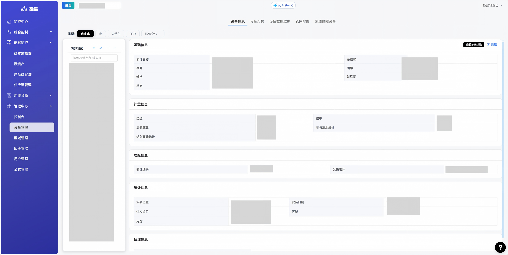
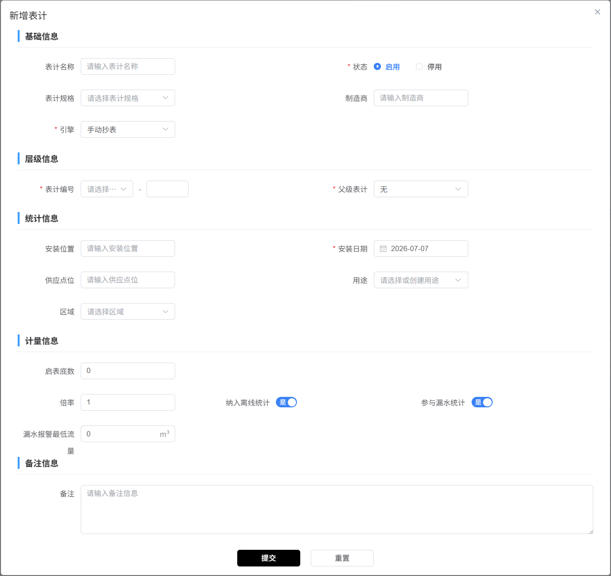
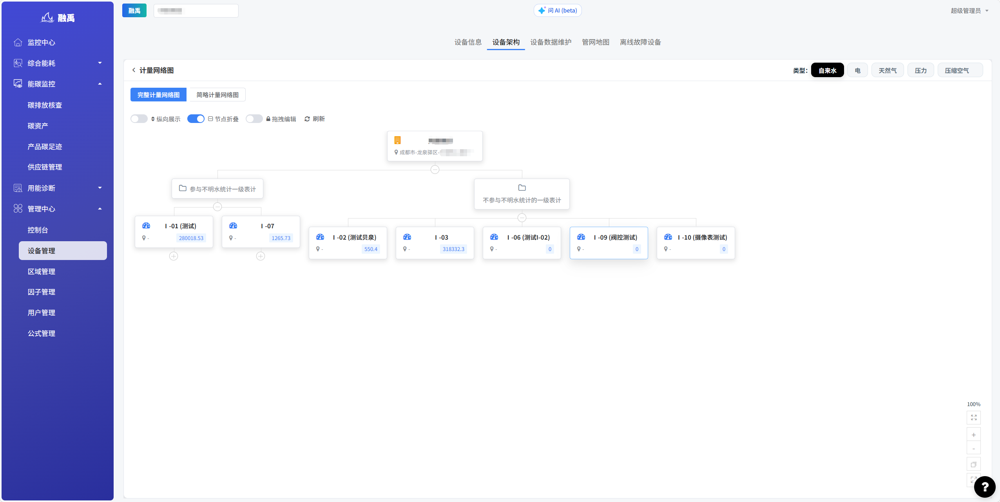
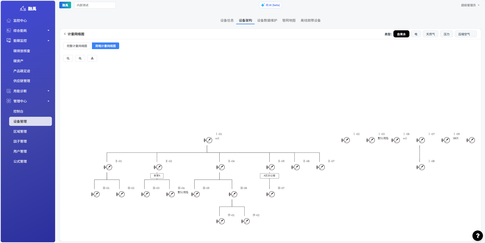
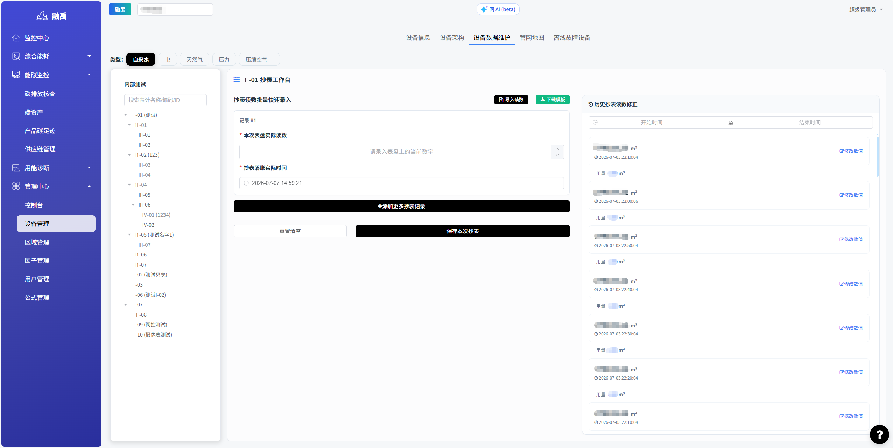
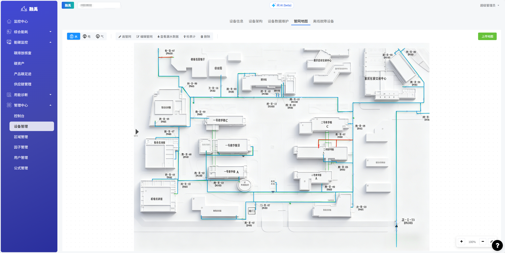
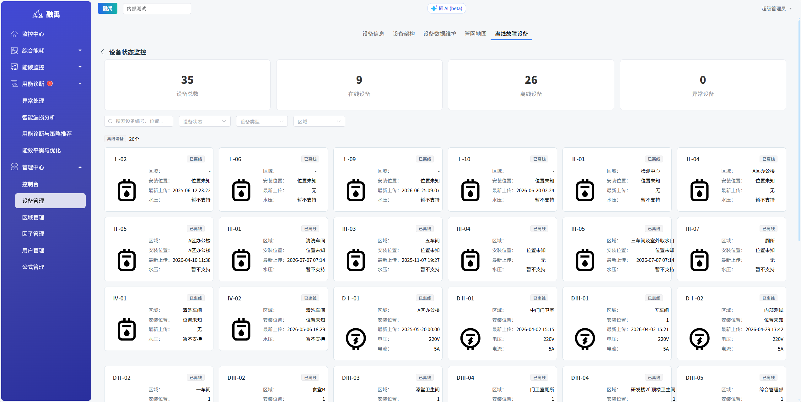

# 设备管理

## 1. 功能概述

### 1.1 模块定位

「设备管理」是系统的基础配置模块，用于管理所有能源计量设备（水表、电表、天然气表、压力表、压缩空气表等），维护设备的层级关系、计量参数和运行状态，为能耗数据采集和分析提供基础。

### 1.2 核心功能

| 功能 | 说明 |
|------|------|
| **设备信息管理** | 查看、新增、编辑计量设备 |
| **设备架构** | 展示设备层级关系树 |
| **设备数据维护** | 批量导入、维护设备读数 |
| **管网地图** | 可视化展示设备管网分布 |
| **离线故障设备** | 监控设备在线状态和故障报警 |

---

## 2. 页面说明

### 2.1 设备信息页

页面分为**左侧设备树**和**右侧详情面板**两部分。

#### 左侧：设备树

- 顶部标签页切换组织（如「内部测试」）
- 工具栏：`+`（新增设备）、`⟳`（刷新）、`□`（折叠/展开）、`⋯`（更多操作）
- 搜索框：按表计名称/编码/ID 搜索
- 树形结构展示设备层级关系（I - 一级、II - 二级、III - 三级、IV - 四级）
- 每个节点前有复选框，可多选操作

#### 设备类型筛选

页面顶部提供类型标签：**自来水**、**电**、**天然气**、**压力**、**压缩空气**，点击切换显示对应类型的设备。

#### 右侧：设备详情

点击左侧设备树中的某个节点后，右侧展示该设备的详细信息，包含以下区域：

**基础信息**
| 字段 | 说明 |
|------|------|
| 表计名称 | 设备名称 |
| 系统ID | 系统自动生成的唯一标识 |
| 表号 | 设备出厂编号 |
| 引擎 | 数据采集引擎（如大连思捷） |
| 规格 | 表计规格型号 |
| 制造商 | 设备制造商 |
| 状态 | 可用/停用 |

**计量信息**
| 字段 | 说明 |
|------|------|
| 类型 | 水表/电表/天然气表等 |
| 倍率 | 计量倍率系数 |
| 启表底数 | 表计初始读数 |
| 参与漏水统计 | 是否纳入漏水计算 |
| 纳入离线统计 | 是否纳入离线监控 |

**层级信息**
| 字段 | 说明 |
|------|------|
| 表计编码 | 设备在层级中的编码 |
| 父级表计 | 上级设备（无则为"无"） |

---

### 2.2 新增表计弹窗

点击左侧工具栏的 `+` 按钮弹出「新增表计」表单，包含以下区域：

#### 基础信息
| 字段 | 必填 | 说明 |
|------|------|------|
| 表计名称 | 是 | 设备名称 |
| 状态 | 是 | 启用/停用（默认启用） |
| 表计规格 | 否 | 从下拉列表选择 |
| 制造商 | 否 | 手动输入 |
| 表号 | 是 | 设备出厂编号 |
| 引擎 | 是 | 选择数据采集引擎（如手动抄表、大连思捷等） |

#### 层级信息
| 字段 | 必填 | 说明 |
|------|------|------|
| 表计编号 | 是 | 选择前缀 + 手动输入编号（如 I - 01） |
| 父级表计 | 是 | 选择上级设备，默认为"无"（即一级设备） |

#### 统计信息
| 字段 | 必填 | 说明 |
|------|------|------|
| 安装位置 | 否 | 设备安装的物理位置 |
| 安装日期 | 是 | 设备安装日期 |
| 供应点位 | 否 | 供应的具体位置 |
| 用途 | 否 | 选择或创建用途分类 |
| 区域 | 否 | 选择设备所属区域 |

#### 计量信息
| 字段 | 说明 |
|------|------|
| 启表底数 | 表计初始读数，默认 0 |
| 倍率 | 计量倍率，默认 1 |
| 纳入离线统计 | 是否参与离线监控（默认是） |
| 参与漏水统计 | 是否参与漏水计算（默认是） |
| 漏水报警最低流量 | 触发漏水报警的最低流量阈值 |

---

## 3. 设备架构页

以树形/图形方式展示所有设备的层级关系

## 4. 设备数据维护页

批量导入和维护设备读数数据

## 5. 管网地图页

在地图上可视化展示设备管网分布

## 6. 离线故障设备页

查看处于离线或故障状态的设备列表

---

