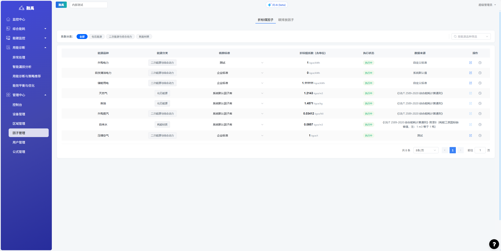
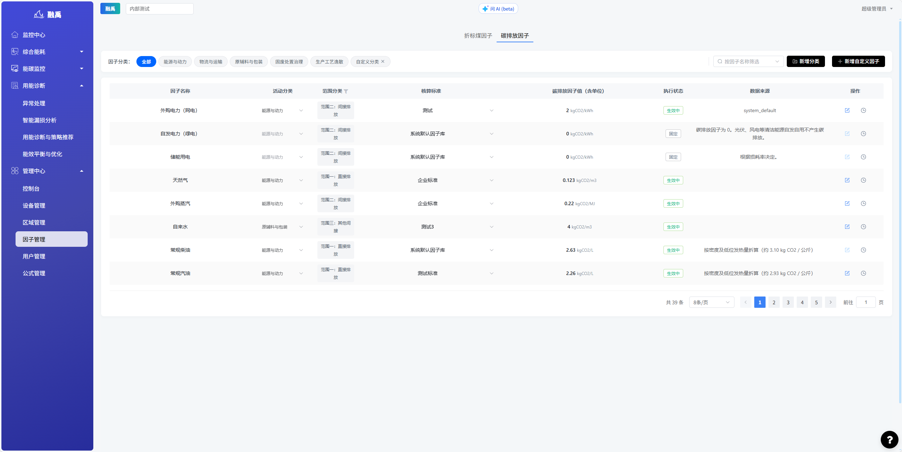
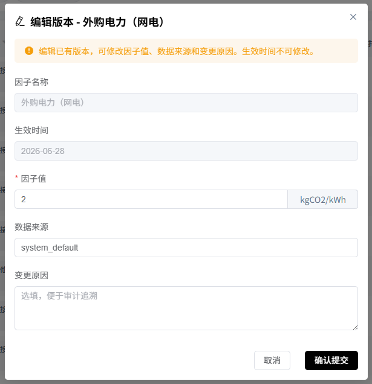
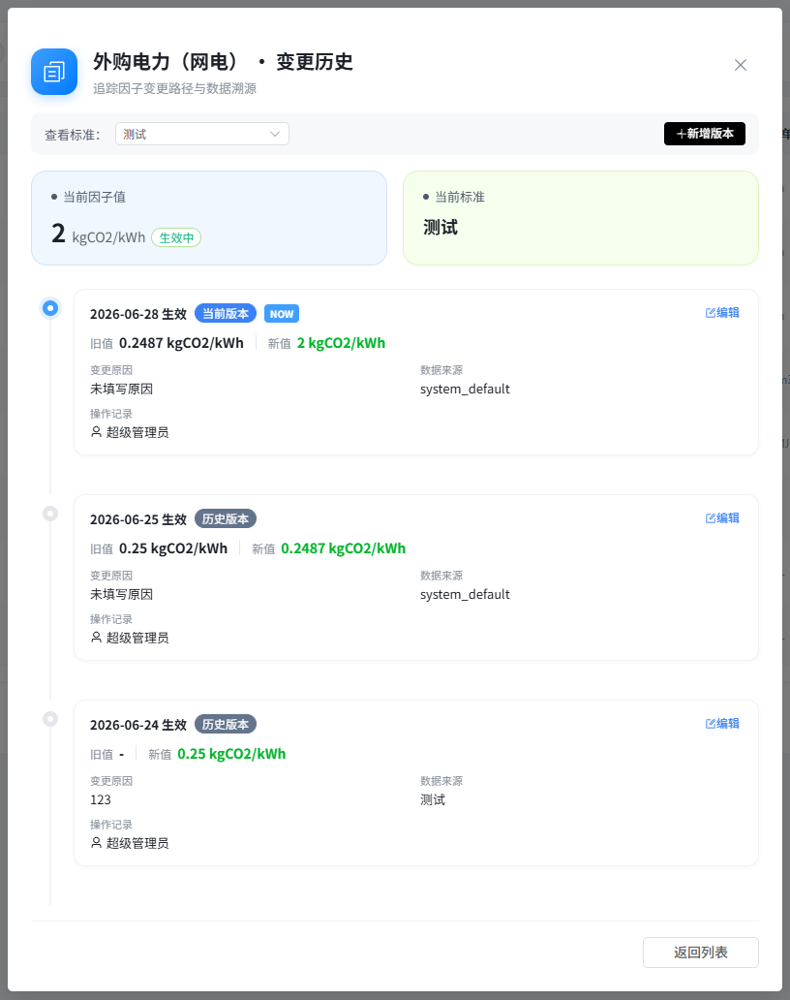

# 因子管理

## 1. 功能概述

### 1.1 模块定位

「因子管理」是系统的核心基础配置模块，用于维护能源消耗折算和碳排放计算所需的各类因子数据。包括**折标煤因子**（将各类能源折算为标准煤当量）和**碳排放因子**（将能源消耗转换为二氧化碳排放量），是能耗统计和碳足迹核算的数据基石。

### 1.2 核心功能

| 功能 | 说明 |
|------|------|
| **折标煤因子管理** | 维护各能源品种的标准煤折算系数 |
| **碳排放因子管理** | 维护各能源品种的碳排放因子 |
| **因子分类筛选** | 按化石能源、二次能源、耗能材质等分类查看 |
| **因子编辑** | 修改因子值、核算标准、数据来源等 |
| **因子版本管理** | 记录因子变更历史，支持版本追溯 |

---

## 2. 页面说明

### 2.1 折标煤因子页

页面顶部有两个标签页：**折标煤因子**和**碳排放因子**，默认显示折标煤因子。

#### 系数分类筛选

| 分类 | 说明 |
|------|------|
| **全部** | 显示所有能源品种 |
| **化石能源** | 煤炭、天然气、石油等一次能源 |
| **二次能源与综合动力** | 电力、蒸汽、压缩空气等 |
| **耗能材质** | 自来水、工业用水等 |

右上角支持**按能源品种筛选**搜索。

#### 因子列表

| 列 | 说明 |
|---|------|
| **能源品种** | 如外购电力、天然气、柴油等 |
| **能源分类** | 所属分类（化石能源/二次能源与综合动力/耗能材质） |
| **核算标准** | 因子的来源标准（企业标准/系统默认因子库/自定义标准/测试） |
| **折标煤系数（含单位）** | 折算为标准煤的系数及单位，如 1 kgce/kWh |
| **执行状态** | 执行中/已停用 |
| **数据来源** | 因子的具体来源说明 |
| **操作** | 编辑（铅笔图标）和版本历史（时钟图标） |

### 2.2 碳排放因子页

点击顶部「碳排放因子」标签页切换到碳排放因子管理页面，页面结构与折标煤因子类似，展示各能源品种的碳排放因子数据。

### 2.3 因子编辑

点击列表右侧的铅笔图标进入编辑页面：

| 可编辑字段 | 说明 |
|-----------|------|
| 折标煤系数/碳排放因子值 | 修改因子数值 |
| 核算标准 | 选择因子来源标准 |
| 执行状态 | 启用/停用该因子 |

> ⚠️ **注意**：修改因子值会影响历史数据的重新计算，请在确认后再修改。

### 2.4 版本历史

点击列表右侧的时钟图标可查看该因子的变更历史记录，包括：
- 修改时间
- 修改前后的因子值
- 修改人
- 修改原因

---

## 3. 操作指南

### 3.1 查看因子数据

1. 在左侧导航栏进入「管理中心 > 因子管理」
2. 默认进入折标煤因子页面
3. 使用分类标签筛选查看特定类型能源的因子
4. 使用右上角搜索框按能源品种名称搜索

### 3.2 切换碳排放因子

1. 点击页面顶部「碳排放因子」标签页
2. 查看各能源品种的碳排放因子数据
3. 操作方式与折标煤因子相同

### 3.3 编辑因子

1. 在因子列表中找到目标能源品种
2. 点击右侧铅笔图标（编辑）
3. 修改因子值或核算标准
4. 保存修改

### 3.4 查看因子版本历史

1. 在因子列表中点击目标行的时钟图标
2. 查看该因子的变更历史记录
3. 了解因子值的修改时间和修改内容

---