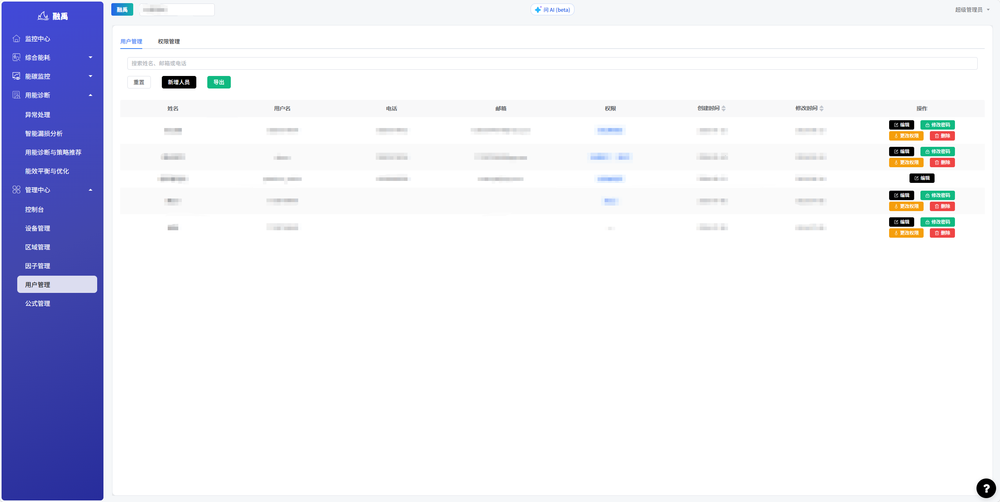
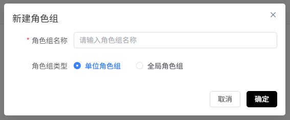

# 用户管理

## 1. 功能概述

### 1.1 模块定位

「用户管理」是系统的权限管理核心模块，用于管理系统用户账号、角色权限分配、密码管理等，确保不同层级的使用者能够按照其职责范围访问和操作系统的相应功能。

### 1.2 核心功能

| 功能 | 说明 |
|------|------|
| **用户列表管理** | 查看、搜索、导出用户信息 |
| **新增人员** | 创建新用户账号并分配角色 |
| **编辑用户** | 修改用户基本信息 |
| **修改密码** | 重置用户密码 |
| **权限管理** | 配置用户的功能访问权限 |
| **删除用户** | 移除不再需要的用户账号 |

---

## 2. 页面说明

### 2.1 用户管理主页

页面顶部有两个标签页：**用户管理**和**权限管理**。

#### 搜索栏

顶部搜索框支持按**姓名、邮箱或电话**搜索用户。

#### 操作按钮

| 按钮 | 说明 |
|------|------|
| **重置** | 清空搜索条件 |
| **新增人员** | 打开新增用户弹窗 |
| **导出** | 导出用户列表数据 |

#### 用户列表

| 列 | 说明 |
|---|------|
| **姓名** | 用户真实姓名 |
| **用户名** | 登录账号 |
| **电话** | 手机号码 |
| **邮箱** | 电子邮箱地址 |
| **权限** | 角色标签（超级管理员/单位管理员/普通用户等） |
| **创建时间** | 账号创建日期 |
| **修改时间** | 最后一次修改的日期 |
| **操作** | 编辑、修改密码、更改权限、删除 |

#### 角色类型

| 角色 | 说明 |
|------|------|
| **超级管理员** | 拥有系统全部权限，可管理所有模块和用户 |
| **单位管理员** | 拥有本单位范围内的管理权限 |
| **普通用户** | 仅有查看和基本操作权限 |

### 2.2 权限管理页

点击顶部「权限管理」标签页进入权限配置页面，可对不同角色组进行细粒度的功能权限配置。

### 2.3 新增人员弹窗

点击「新增人员」按钮弹出表单：

| 字段 | 必填 | 说明 |
|------|------|------|
| **真实姓名** | 是 | 用户真实姓名 |
| **手机号** | 否 | 手机号码 |
| **邮箱** | 否 | 电子邮箱地址 |
| **账号** | 是 | 登录账号（唯一） |
| **密码** | 是 | 登录密码 |
| **角色组** | 是 | 选择角色（单位管理员/普通用户等） |
| **选择要添加的角色组** | 否 | 可同时分配多个角色组 |

填写完成后点击「提交」创建用户，点击「重置」清空表单。

---

## 3. 操作指南

### 3.1 查看用户列表

1. 在左侧导航栏进入「管理中心 > 用户管理」
2. 默认进入用户管理列表页
3. 使用顶部搜索框按姓名、邮箱或电话筛选用户
4. 点击「重置」清除搜索条件

### 3.2 新增用户

1. 点击「新增人员」按钮
2. 填写必填字段（真实姓名、账号、密码、角色组）
3. 选择适当的角色组
4. 点击「提交」完成创建

> 💡 **注意**：账号名称在系统中必须唯一，重复的账号无法创建。

### 3.3 编辑用户

1. 在用户列表中找到目标用户
2. 点击右侧「编辑」按钮
3. 修改用户信息
4. 保存修改

### 3.4 修改密码

1. 在用户列表中点击目标用户的「修改密码」按钮
2. 输入新密码
3. 确认保存

> 💡 **建议**：密码修改后请通知用户及时登录并更改为个人密码。

### 3.5 更改权限

1. 在用户列表中点击目标用户的「更改权限」按钮
2. 选择新的角色或调整权限范围
3. 保存修改

### 3.6 删除用户

1. 在用户列表中点击目标用户的「删除」按钮
2. 确认删除操作
3. 用户账号将被移除

> ️ **警告**：删除操作不可逆，请确认该用户确实不再需要访问系统后再执行删除。

### 3.7 导出用户数据

1. 点击页面顶部「导出」按钮
2. 系统导出当前用户列表数据（含搜索筛选结果）
3. 下载 Excel 文件

### 3.8 权限管理    

1. 点击顶部「权限管理」标签页
2. 查看各角色组的功能权限配置
3. 按需调整角色权限范围

---
